# 第一章 行列式 (Determinants)

--------------------------------------------------------------------------------

## 知识框架导引

```mermaid
graph TD
    A["第一章 行列式"] --> B["一、概念与几何本质"]
    A --> C["二、基本性质与计算律"]
    A --> D["三、展开定理与代数余子式"]
    A --> E["四、12+1 典型形态速算"]
    A --> F["五、克拉默法则与方程判定"]

    B --> B1["有向体积与线性变换伸缩比"]
    B --> B2["全排列与逆序数定义"]
    B --> B3["主对角与副对角三角行列式"]

    C --> C1["转置不变性 |A^T|=|A|"]
    C --> C2["互换两行变号与成比例为零"]
    C --> C3["单行单列可加性与倍加变换"]
    C --> C4["方阵乘积行列式 |AB|=|A||B|"]

    D --> D1["余子式与代数余子式本质"]
    D --> D2["拉普拉斯行/列展开定理"]
    D --> D3["异行相乘为零与伴随矩阵 AA*=|A|E"]

    E --> E1["爪型 / 箭型行列式"]
    E --> E2["各行各列和相等型"]
    E --> E3["X 型与三对角带状行列式"]
    E --> E4["范德蒙德型及其化简构造"]
    E --> E5["升阶加边法与拆项消元法"]

    F --> F1["非齐次方程唯一解公式"]
    F --> F2["齐次方程非零解的行列式判定"]
```

--------------------------------------------------------------------------------

## 1. 行列式的概念与几何意义

###### **定义[1]: 行列式的几何意义 (有向体积与线性变换伸缩因子)**

>[1] 二维空间的几何直观：
>
>在二维直角坐标系 $\mathbb{R}^2$ 中，设有两个平面向量 $\vec{\alpha} = (a_1, a_2)^T$，$\vec{\beta} = (b_1, b_2)^T$。由这两条向量作为邻边张成的平行四边形的**有向面积**为：
>
>$$S = \begin{vmatrix} a_1 & b_1 \\ \\ a_2 & b_2 \end{vmatrix} = a_1 b_2 - a_2 b_1$$
>
>若从 $\vec{\alpha}$ 到 $\vec{\beta}$ 的转向为逆时针方向，则该有向面积为正值；若转向为顺时针方向，则有向面积为负值；若两向量共线，则平行四边形退化，面积为 $0$。
>
>[2] 三维空间的几何直观：
>
>在三维空间 $\mathbb{R}^3$ 中，三个列向量 $\vec{\alpha}_1, \vec{\alpha}_2, \vec{\alpha}_3$ 张成的平行六面体的**有向体积**，在数值上等于它们构成的 3 阶方阵的行列式：
>
>$$V = \det [\vec{\alpha}_1, \vec{\alpha}_2, \vec{\alpha}_3] = \vec{\alpha}_1 \cdot (\vec{\alpha}_2 \times \vec{\alpha}_3)$$
>
>其正负号取决于三个向量是否构成右手系。
>
>[3] $n$ 维空间的超体积与算子几何伸缩比：
>
>在 $n$ 维欧氏空间 $\mathbb{R}^n$ 中，$n$ 阶行列式 $\det(A) = \det[\vec{\alpha}_1, \vec{\alpha}_2, \dots, \vec{\alpha}_n]$ 的绝对值，等于这 $n$ 个列向量张成的 $n$ 维超平行多面体的超体积。
>
>若将方阵 $A$ 视为空间线性变换 $T: \mathbb{R}^n \to \mathbb{R}^n$ 的坐标矩阵，则 $\det(A)$ 代表该线性变换对空间区域体积的**定向膨胀/压缩倍率**：
>
>(1) 当 $\det(A) > 0$ 时，变换保持空间的手性定向不变，体积放大（或缩小）至原来的 $\det(A)$ 倍；
>
>(2) 当 $\det(A) < 0$ 时，变换反转空间手性定向（如镜像反射）；
>
>(3) 当 $\det(A) = 0$ 时，空间被压缩至更低维度（降维退化），超体积变为 $0$，表明这 $n$ 个向量线性相关。

###### **定义[2]: 全排列与逆序数**

>[1] 全排列定义：
>
>由 $1, 2, \dots, n$ 组成的一个没有重复数字的序列 $p_1 p_2 \dots p_n$ 称为一个 $n$ 级全排列。所有不同的 $n$ 级全排列共有 $n!$ 种。
>
>[2] 逆序与逆序数：
>
>在一个排列中，若较大的数排在较小的数前面，则称这两个数构成一个**逆序**。
>
>一个排列中包含的所有逆序的总数，称为该排列的**逆序数**，记作 $\tau(p_1 p_2 \dots p_n)$。
>
>(1) 逆序数的计算规则：
>
>$$\tau(p_1 p_2 \dots p_n) = \sum_{i=1}^{n-1} t_i$$
>
>其中 $t_i$ 为在元素 $p_i$ 后面且数值比 $p_i$ 小的元素个数。
>
>(2) 奇排列与偶排列：
>
>逆序数为偶数的排列称为**偶排列**；逆序数为奇数的排列称为**奇排列**。标准排列 $1 2 \dots n$ 的逆序数为 $0$，因而是偶排列。
>
>[3] 对换定理：
>
>对一个排列中的任意两个元素进行对换，排列的奇偶性必然改变。
>
>在全部 $n!$ 个 $n$ 级排列中（当 $n \ge 2$ 时），奇排列与偶排列各占一半，即各有 $\frac{n!}{2}$ 个。

###### **定义[3]: $n$ 阶行列式的完全代数展开定义**

>[1] 完全代数展开式：
>
>设有 $n^2$ 个数构成的 $n$ 阶方阵 $A = (a_{ij})_{n \times n}$，由这些数组成的 $n$ 阶行列式定义为：
>
>$$D = |A| = \sum_{p_1 p_2 \dots p_n} (-1)^{\tau(p_1 p_2 \dots p_n)} a_{1p_1} a_{2p_2} \dots a_{np_n}$$
>
>其中求和号遍及所有 $n!$ 个不同的列标全排列 $p_1 p_2 \dots p_n$。
>
>[2] 展开项的结构特征：
>
>(1) 每项均由取自不同行、不同列的 $n$ 个元素的乘积组成；
>
>(2) 共有 $n!$ 项相加，其中带正号与带负号的项各占 $\frac{n!}{2}$ 项；
>
>(3) 符号由行标与列标排列的逆序数和共同决定：
>
>$$(-1)^{\tau(i_1 i_2 \dots i_n) + \tau(j_1 j_2 \dots j_n)}$$
>
>当行标排成标准自然顺序 $1 2 \dots n$ 时，项的符号直接由列标排列的逆序数 $\tau(p_1 p_2 \dots p_n)$ 的奇偶性决定。

###### **公式[1]: 三角形行列式与特殊基本型**

>[1] 上三角与下三角行列式：
>
>主对角线下方或上方元素全为 $0$ 的行列式，其值等于主对角线上所有元素的连乘积：
>
>$$\begin{vmatrix} a_{11} & a_{12} & \cdots & a_{1n} \\ \\ 0 & a_{22} & \cdots & a_{2n} \\ \\ \vdots & \vdots & \ddots & \vdots \\ \\ 0 & 0 & \cdots & a_{nn} \end{vmatrix} = \begin{vmatrix} a_{11} & 0 & \cdots & 0 \\ \\ a_{21} & a_{22} & \cdots & 0 \\ \\ \vdots & \vdots & \ddots & \vdots \\ \\ a_{n1} & a_{n2} & \cdots & a_{nn} \end{vmatrix} = \prod_{i=1}^n a_{ii} = a_{11} a_{22} \dots a_{nn}$$
>
>[2] 副三角行列式：
>
>副对角线上方或下方元素全为 $0$ 的行列式，其值等于副对角线元素的乘积乘以系数 $(-1)^{\frac{n(n-1)}{2}}$：
>
>$$\begin{vmatrix} a_{11} & \cdots & a_{1,n-1} & a_{1n} \\ \\ a_{21} & \cdots & a_{2,n-1} & 0 \\ \\ \vdots & \ddots & \vdots & \vdots \\ \\ a_{n1} & \cdots & 0 & 0 \end{vmatrix} = (-1)^{\frac{n(n-1)}{2}} a_{1n} a_{2,n-1} \dots a_{n1}$$
>
>其中符号因子的来源：反向排列 $n(n-1)\dots 2 1$ 的逆序数为 $\tau(n, n-1, \dots, 1) = \frac{n(n-1)}{2}$。

--------------------------------------------------------------------------------

## 2. 行列式的基本性质与运算律

###### **性质[1]: 转置不变性**

>[1] 定理描述：
>
>方阵 $A$ 的行列式与其转置矩阵 $A^T$ 的行列式相等，即：
>
>$$|A^T| = |A|$$
>
>[2] 核心理论推论：
>
>行列式中“行”与“列”的地位是完全对称的。凡是对行成立的性质、运算法则与展开定理，对列也完全对应成立。

###### **性质[2]: 两行(列)互换变号性**

>[1] 定理描述：
>
>互换行列式的某两行（或两列），行列式的值改变符号。
>
>[2] 推论：
>
>若行列式中有两行（或两列）的对应元素完全相同，则该行列式必为 $0$。
>
>证明思路：设互换相同的两行，一方面数值变为 $-D$，另一方面行列式本身未变故仍为 $D$，因此 $D = -D \implies D = 0$。

###### **性质[3]: 单行(列)公因式提取与倍乘性**

>[1] 定理描述：
>
>行列式的某一行（或某一列）中所有元素都乘以同一常数 $k$，等于用数 $k$ 乘以此行列式：
>
>$$\begin{vmatrix} a_{11} & a_{12} & \cdots & a_{1n} \\ \\ \vdots & \vdots & & \vdots \\ \\ k a_{i1} & k a_{i2} & \cdots & k a_{in} \\ \\ \vdots & \vdots & & \vdots \\ \\ a_{n1} & a_{n2} & \cdots & a_{nn} \end{vmatrix} = k \begin{vmatrix} a_{11} & a_{12} & \cdots & a_{1n} \\ \\ \vdots & \vdots & & \vdots \\ \\ a_{i1} & a_{i2} & \cdots & a_{in} \\ \\ \vdots & \vdots & & \vdots \\ \\ a_{n1} & a_{n2} & \cdots & a_{nn} \end{vmatrix}$$
>
>[2] 极高频考点注意：
>
>矩阵数乘与行列式数乘的重大区别：
>
>(1) 矩阵数乘：$k A$ 是将矩阵 $A$ 的**全部 $n^2$ 个元素**都乘以 $k$；
>
>(2) 行列式提公因数：从每一行提出一个因子 $k$，$n$ 阶方阵共提出 $n$ 个 $k$：
>
>$$|kA| = k^n |A|$$

###### **性质[4]: 成比例与全零行(列)为零**

>[1] 定理描述：
>
>若行列式中有两行（或两列）的对应元素成比例，或者某一行（列）的所有元素全为 $0$，则该行列式的值必为 $0$。

###### **性质[5]: 单行(列)可加性 (拆项性质)**

>[1] 定理描述：
>
>若行列式的某一行（或某一列）的每个元素均为两数之和，则此行列式可以拆分成两个行列式之和：
>
>$$\begin{vmatrix} a_{11} & a_{12} & \cdots & a_{1n} \\ \\ \vdots & \vdots & & \vdots \\ \\ b_1 + c_1 & b_2 + c_2 & \cdots & b_n + c_n \\ \\ \vdots & \vdots & & \vdots \\ \\ a_{n1} & a_{n2} & \cdots & a_{nn} \end{vmatrix} = \begin{vmatrix} a_{11} & a_{12} & \cdots & a_{1n} \\ \\ \vdots & \vdots & & \vdots \\ \\ b_1 & b_2 & \cdots & b_n \\ \\ \vdots & \vdots & & \vdots \\ \\ a_{n1} & a_{n2} & \cdots & a_{nn} \end{vmatrix} + \begin{vmatrix} a_{11} & a_{12} & \cdots & a_{1n} \\ \\ \vdots & \vdots & & \vdots \\ \\ c_1 & c_2 & \cdots & c_n \\ \\ \vdots & \vdots & & \vdots \\ \\ a_{n1} & a_{n2} & \cdots & a_{nn} \end{vmatrix}$$
>
>[2] 易错避坑防线：
>
>行列式拆分只能按**单一行（或单一步单一列）**线性拆分，绝对不能对多个行同时拆开！若每一行都由两个元素相加构成，$n$ 阶行列式全部拆开将产生 $2^n$ 个子行列式。

###### **性质[6]: 倍加行(列)变换保持行列式值不变**

>[1] 定理描述：
>
>将行列式某一行（或某一列）的所有元素乘以常数 $k$ 后加到另一行（或另一列）的对应元素上去，行列式的值保持不变：
>
>$$r_i + k r_j \implies |A_{\text{new}}| = |A| \quad (i \neq j)$$
>
>[2] 核心地位：
>
>倍加变换是高斯消元法将一般行列式化为上三角行列式、对角行列式或爪型消元时**最核心、使用频次最高**的保值初等工具。

###### **性质[7]: 矩阵乘积行列式乘法定理 (柯西-比内定理特例)**

>[1] 定理描述：
>
>设 $A, B$ 为同阶 $n$ 阶方阵，则两方阵乘积的行列式等于各自行列式的乘积：
>
>$$|AB| = |A| \cdot |B|$$
>
>[2] 常用推广结论：
>
>(1) 多个方阵连乘：$|A_1 A_2 \dots A_m| = |A_1| \cdot |A_2| \dots |A_m|$；
>
>(2) 幂运算：$|A^k| = |A|^k \quad (k \in \mathbb{N}^+)$；
>
>(3) 可逆方阵的逆矩阵：由于 $A A^{-1} = E \implies |A| \cdot |A^{-1}| = |E| = 1$，故：
>
>$$|A^{-1}| = \frac{1}{|A|} = |A|^{-1}$$
>
>(4) 相似矩阵行列式相等：若 $B = P^{-1} A P$，则：
>
>$$|B| = |P^{-1}| \cdot |A| \cdot |P| = \frac{1}{|P|} \cdot |A| \cdot |P| = |A|$$

--------------------------------------------------------------------------------

## 3. 按行/列展开定理与代数余子式

###### **定义[1]: 余子式与代数余子式**

>[1] 余子式 $M_{ij}$：
>
>在 $n$ 阶行列式 $D = |A|$ 中，划去元素 $a_{ij}$ 所在的第 $i$ 行和第 $j$ 列后，剩下的 $(n-1)^2$ 个元素按原有相对位置构成的 $n-1$ 阶行列式，称为元素 $a_{ij}$ 的**余子式**，记作 $M_{ij}$。
>
>[2] 代数余子式 $A_{ij}$：
>
>记：
>
>$$A_{ij} = (-1)^{i+j} M_{ij}$$
>
>称 $A_{ij}$ 为元素 $a_{ij}$ 的**代数余子式**。
>
>[3] 代数余子式的独立性本质：
>
>$M_{ij}$ 与 $A_{ij}$ 的具体数值仅由该行列式除第 $i$ 行和第 $j$ 列之外的其余元素决定，**与元素 $a_{ij}$ 本身的具体数值毫无关系**！

###### **定理[1]: 拉普拉斯按行/按列展开定理**

>[1] 展开定理公式：
>
>行列式等于它的任一行（或任一列）的各元素与其对应的代数余子式乘积之和：
>
>(1) 按第 $i$ 行展开：
>
>$$|A| = \sum_{j=1}^n a_{ij} A_{ij} = a_{i1} A_{i1} + a_{i2} A_{i2} + \dots + a_{in} A_{in}$$
>
>(2) 按第 $j$ 列展开：
>
>$$|A| = \sum_{i=1}^n a_{ij} A_{ij} = a_{1j} A_{1j} + a_{2j} A_{2j} + \dots + a_{nj} A_{nj}$$

###### **定理[2]: 异行/异列正交乘积定理**

>[1] 定理描述：
>
>行列式某一行（或某一列）的元素与另一行（或另一列）对应元素的代数余子式的乘积之和恒等于零：
>
>(1) 异行相乘：
>
>$$\sum_{j=1}^n a_{ij} A_{kj} = a_{i1} A_{k1} + a_{i2} A_{k2} + \dots + a_{in} A_{kn} = 0 \quad (i \neq k)$$
>
>(2) 异列相乘：
>
>$$\sum_{i=1}^n a_{ij} A_{ik} = a_{1j} A_{1k} + a_{2j} A_{2k} + \dots + a_{nj} A_{nk} = 0 \quad (j \neq k)$$
>
>[2] 综合克罗内克符号表示：
>
>$$\sum_{j=1}^n a_{ij} A_{kj} = |A| \delta_{ik} = \begin{cases} |A|, & i = k \\ \\ 0, & i \neq k \end{cases}$$
>
>[3] 伴随矩阵与求逆公式的矩阵视角：
>
>记方阵 $A$ 的伴随矩阵为 $A^* = (A_{ji})_{n \times n}$（注意行列下标转置置换），上述同行动行与异行定理等价于矩阵乘法等式：
>
>$$A A^* = A^* A = |A| E$$
>
>当 $|A| \neq 0$ 时，方阵 $A$ 可逆且其逆矩阵为：
>
>$$A^{-1} = \frac{1}{|A|} A^*$$

###### **方法[1]: “换数法”速求代数余子式线性组合**

>[1] 核心解题策略：
>
>考研常考计算形式如 $\sum_{j=1}^n k_j A_{ij} = k_1 A_{i1} + k_2 A_{i2} + \dots + k_n A_{in}$。
>
>由于代数余子式 $A_{ij}$ 与第 $i$ 行原元素无关，此线性组合的几何与代数实质为：**将原行列式第 $i$ 行的元素全部替换为对应的系数序列 $(k_1, k_2, \dots, k_n)$ 所构成的全新行列式的值**！
>
>[2] 混杂余子式 $M_{ij}$ 转化原则：
>
>若题目出现 $M_{ij}$，必须统一化为代数余子式 $A_{ij} = (-1)^{i+j} M_{ij}$，即 $M_{ij} = (-1)^{i+j} A_{ij}$，将其转化为负号或正号计入系数后再用换数法求值。

--------------------------------------------------------------------------------

## 4. 考研常考 12+1 典型形态速算指南

###### **形态[1]: 上三角与下三角型**

>[1] 识别特征：主对角线一侧全为 $0$。
>
>[2] 求解口诀：直接连乘对角线：$D = a_{11} a_{22} \dots a_{nn}$。

###### **形态[2]: 副三角型**

>[1] 识别特征：副对角线一侧全为 $0$。
>
>[2] 求解公式：$D = (-1)^{\frac{n(n-1)}{2}} a_{1n} a_{2,n-1} \dots a_{n1}$。

###### **形态[3]: 拉普拉斯分块主对角型**

>[1] 矩阵结构：设 $A$ 为 $m$ 阶方阵，$B$ 为 $n$ 阶方阵：
>
>$$\begin{vmatrix} A & O \\ \\ C & B \end{vmatrix} = \begin{vmatrix} A & C \\ \\ O & B \end{vmatrix} = |A| \cdot |B|$$
>
>[2] 本质原理：对前 $m$ 行或后 $n$ 行逐层展开。

###### **形态[4]: 拉普拉斯分块副对角型**

>[1] 矩阵结构：设 $A$ 为 $m$ 阶方阵，$B$ 为 $n$ 阶方阵：
>
>$$\begin{vmatrix} O & A \\ \\ B & C \end{vmatrix} = \begin{vmatrix} C & A \\ \\ B & O \end{vmatrix} = (-1)^{mn} |A| \cdot |B|$$
>
>[2] 核心避坑：变号因子为 $(-1)^{mn}$，由行（列）对换次数 $mn$ 决定。

###### **形态[5]: 爪型 (箭型) 行列式**

>[1] 结构特征：只有第一行、第一列及主对角线上有非零元素，其余位置全为 $0$（形似鸡爪或箭头）。
>
>[2] 解法：利用主对角线上的非零元，对第一行（或第一列）进行初等变换，将其斜向爪翼元素消为 $0$，化为主对角三角行列式。

###### **形态[6]: 各行(列)和相等型**

>[1] 结构特征：每一行所有元素的和为一个常数 $S$（或每一列和为常数 $S$）。
>
>[2] 经典三步解法：
>
>(1) 将第 $2, 3, \dots, n$ 列全加到第 $1$ 列；
>
>(2) 第 $1$ 列元素全变为 $S$，提出公因式 $S$；
>
>(3) 第 $1$ 列全化为 $1$，用第 $1$ 行的 $-1$ 倍加到其余各行，将下方全消成阶梯上三角。
>
>[3] 经典范式公式：主对角为 $a$、其余全为 $b$ 的 $n$ 阶行列式：
>
>$$D_n = \begin{vmatrix} a & b & \cdots & b \\ \\ b & a & \cdots & b \\ \\ \vdots & \vdots & \ddots & \vdots \\ \\ b & b & \cdots & a \end{vmatrix} = [a + (n-1)b](a - b)^{n-1}$$

###### **形态[7]: “X”型行列式**

>[1] 结构特征：仅在主对角线和副对角线上有非零元素，矩阵呈“X”字形交叉。
>
>[2] 解法：将对称位置的两行（如第 $i$ 行与第 $n+1-i$ 行）通过倍加消去副对角元素，拆解为 $2 \times 2$ 阶子块乘积。
>
>[3] $2k$ 阶通项公式：
>
>$$D_{2k} = \prod_{i=1}^k (a_i a_{2k+1-i} - b_i b_{2k+1-i})$$

###### **形态[8]: 范德蒙德型 (Vandermonde)**

>[1] 标准范式：
>
>$$V_n = \begin{vmatrix} 1 & 1 & \cdots & 1 \\ \\ x_1 & x_2 & \cdots & x_n \\ \\ x_1^2 & x_2^2 & \cdots & x_n^2 \\ \\ \vdots & \vdots & & \vdots \\ \\ x_1^{n-1} & x_2^{n-1} & \cdots & x_n^{n-1} \end{vmatrix} = \prod_{1 \le i < j \le n} (x_j - x_i)$$
>
>[2] 记忆核心：**大标号减小标号连乘积**，共含有 $C_n^2 = \frac{n(n-1)}{2}$ 个二项式因子。
>
>[3] 变型应用：若某一行或列不满足幂次规律，常通过拆项、加边补齐高次项化为标准范德蒙德型。

###### **形态[9]: 三对角 (带状) 行列式**

>[1] 结构特征：非零元素仅集中在主对角线、主对角线上方相邻次对角线、主对角线下方相邻次对角线。
>
>[2] 标准解法：按第一行（或第一列）展开，建立关于阶数 $n$ 的二阶常系数线性递推关系式：
>
>$$D_n = p D_{n-1} + q D_{n-2}$$
>
>解其特征方程 $x^2 - p x - q = 0$ 求通项。

###### **形态[10]: 升阶加边法 (Bordering)**

>[1] 适用场景：行列式中各行（列）包含公共元素与独立元素的线性组合，直接消元难以批量归零。
>
>[2] 操作要领：引入第 $0$ 行与第 $0$ 列，构造成高一阶的 $(n+1)$ 阶行列式：
>
>$$D_n = \begin{vmatrix} 1 & 0 & 0 & \cdots & 0 \\ \\ x_1 & a_{11} & a_{12} & \cdots & a_{1n} \\ \\ x_2 & a_{21} & a_{22} & \cdots & a_{2n} \\ \\ \vdots & \vdots & \vdots & \ddots & \vdots \\ \\ x_n & a_{n1} & a_{n2} & \cdots & a_{nn} \end{vmatrix}$$
>
>保持值不变的同时，创造利用第 $0$ 行集中消除内部所有独立参数的通道。

###### **形态[11]: 拆项法 (列/行线性可加分解)**

>[1] 适用场景：行列式的某一行（列）为两项和，或者整体可以写成两个矩阵之和。
>
>[2] 解法：利用性质[5]按单行或单列依次拆开，利用成比例行为零的性质大幅舍弃多余子行列式。

###### **形态[12]: 抽象行列式与列分块乘积法**

>[1] 核心理论工具：
>
>若方阵 $B$ 的列向量是方阵 $A$ 列向量的线性组合，即：
>
>$$[\vec{\beta}_1, \vec{\beta}_2, \dots, \vec{\beta}_n] = [\vec{\alpha}_1, \vec{\alpha}_2, \dots, \vec{\alpha}_n] C$$
>
>则根据乘积行列式定理直接得出：
>
>$$|B| = |A| \cdot |C|$$
>
>将复杂的向量组抽象行列式计算，完全转化为对过渡矩阵 $C$ 的数值行列式求解。

###### **形态[+1]: 克拉默法则 (Cramer's Rule)**

>[1] 定理陈述 (非齐次方程组唯一解)：
>
>设有包含 $n$ 个方程、$n$ 个未知数的非齐次线性方程组：
>
>$$\begin{cases} a_{11} x_1 + a_{12} x_2 + \dots + a_{1n} x_n = b_1 \\ \\ a_{21} x_1 + a_{22} x_2 + \dots + a_{2n} x_n = b_2 \\ \\ \dots\dots \\ \\ a_{n1} x_1 + a_{n2} x_2 + \dots + a_{nn} x_n = b_n \end{cases}$$
>
>若其系数行列式 $D = |A| \neq 0$，则该方程组**有且仅有唯一解**，且解的表达式为：
>
>$$x_j = \frac{D_j}{D} \quad (j = 1, 2, \dots, n)$$
>
>其中 $D_j$ 是将系数行列式 $D$ 中的第 $j$ 列替换为常数项列向量 $(b_1, b_2, \dots, b_n)^T$ 后所得到的 $n$ 阶行列式。
>
>[2] 齐次线性方程组的零解与非零解判定：
>
>对于 $n$ 个方程、$n$ 个未知数的齐次线性方程组 $A \vec{x} = \vec{0}$：
>
>(1) $D = |A| \neq 0 \iff$ 方程组**只有零解**；
>
>(2) $D = |A| = 0 \iff$ 方程组**有非零解**（且必有无穷多解）。
