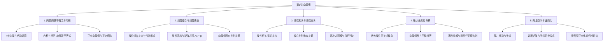

# 第3讲 向量组：全景理论与方法体系

---

## 1. 向量的基本概念与内积运算

### 1.1 n维向量的概念与线性运算
>[1] **基本定义与记号**
>
>> $n$ 个有次序的数 $a_1, a_2, \dots, a_n$ 组成的有序数组称为 **$n$ 维向量**。
>
>> 向量分为列向量与行向量两种书写形式。考研线性代数中，若无特殊说明，向量默认均为**列向量**：
>
>> $$
\alpha = \begin{bmatrix} a_1 \\ \\ a_2 \\ \\ \vdots \\ \\ a_n \end{bmatrix}, \quad \alpha^T = [a_1, a_2, \dots, a_n]
$$
>
>> 分量全为 0 的向量称为 **零向量**，记作 $0$ 或 $\mathbf{0}$。分量全取相反数的向量称为 $\alpha$ 的 **负向量**，记作 $-\alpha$。
>
>[2] **向量的线性运算**
>
>> 设 $\alpha = [a_1, a_2, \dots, a_n]^T, \beta = [b_1, b_2, \dots, b_n]^T \in \mathbb{R}^n, k \in \mathbb{R}$：
>
>> (1) **向量加法**：$\alpha + \beta = [a_1 + b_1, a_2 + b_2, \dots, a_n + b_n]^T$。
>
>> (2) **数乘向量**：$k\alpha = [ka_1, ka_2, \dots, ka_n]^T$。
>
>> 线性运算满足交换律、结合律、数乘分配律等 8 条经典向量空间代数运算公理。

---

### 1.2 向量内积与几何性质
>[1] **内积定义与代数表达**
>
>> 设有两个 $n$ 维列向量 $\alpha = [a_1, a_2, \dots, a_n]^T, \beta = [b_1, b_2, \dots, b_n]^T$：
>
>> 实数 $(\alpha, \beta) = \alpha^T \beta = a_1 b_1 + a_2 b_2 + \dots + a_n b_n = \sum_{i=1}^n a_i b_i$ 称为向量 $\alpha$ 与 $\beta$ 的 **内积**。
>
>> 内积具有以下 4 条核心代数性质：
>
>> (1) **对称性**：$(\alpha, \beta) = (\beta, \alpha)$。
>
>> (2) **线性性**：$(k\alpha, \beta) = k(\alpha, \beta)$，$(\alpha_1 + \alpha_2, \beta) = (\alpha_1, \beta) + (\alpha_2, \beta)$。
>
>> (3) **正定性**：$(\alpha, \alpha) \ge 0$，且 $(\alpha, \alpha) = 0 \iff \alpha = \mathbf{0}$。
>
>> (4) **矩阵乘积内积恒等式**：$(A\alpha, \beta) = (A\alpha)^T \beta = \alpha^T A^T \beta = (\alpha, A^T \beta)$。
>
>[2] **范数、柯西-施瓦茨不等式与夹角**
>
>> (1) **向量长度（模/欧氏范数）**：
>
>> $$
\|\alpha\| = \sqrt{(\alpha, \alpha)} = \sqrt{\sum_{i=1}^n a_i^2}
$$
>
>> 当 $\|\alpha\| = 1$ 时称 $\alpha$ 为 **单位向量**。非零向量除以其模长称为 **单位化（规范化）**：$\alpha^0 = \frac{\alpha}{\|\alpha\|}$。
>
>> (2) **柯西-施瓦茨不等式（Cauchy-Schwarz Inequality）**：
>
>> $$
|(\alpha, \beta)| \le \|\alpha\| \cdot \|\beta\|
$$
>
>> 展开写即为：
>
>> $$
\left(\sum_{i=1}^n a_i b_i\right)^2 \le \left(\sum_{i=1}^n a_i^2\right) \left(\sum_{i=1}^n b_i^2\right)
$$
>
>> 等号成立的充要条件是：向量 $\alpha$ 与 $\beta$ 线性相关（存在常数 $k$ 使得 $\alpha = k\beta$ 或 $\beta = k\alpha$）。
>
>> (3) **向量夹角**：
>
>> 对于任意两个非零向量 $\alpha, \beta$，定义其夹角 $\theta \in [0, \pi]$：
>
>> $$
\cos\theta = \frac{(\alpha, \beta)}{\|\alpha\| \cdot \|\beta\|}
$$
>
>> 若 $(\alpha, \beta) = 0$，则称向量 $\alpha$ 与 $\beta$ **正交（互相垂直）**，记作 $\alpha \perp \beta$。零向量与任意向量正交。
>
>[3] **格拉姆矩阵（Gram Matrix）**
>
>> 设矩阵 $A = [\alpha_1, \alpha_2, \dots, \alpha_m]$，则其内积对称阵（Gram 矩阵）为：
>
>> $$
G = A^T A = \begin{bmatrix} (\alpha_1, \alpha_1) & (\alpha_1, \alpha_2) & \dots & (\alpha_1, \alpha_m) \\ \\ (\alpha_2, \alpha_1) & (\alpha_2, \alpha_2) & \dots & (\alpha_2, \alpha_m) \\ \\ \vdots & \vdots & \ddots & \vdots \\ \\ (\alpha_m, \alpha_1) & (\alpha_m, \alpha_2) & \dots & (\alpha_m, \alpha_m) \end{bmatrix}
$$
>
>> 矩阵 $A^TA$ 必为实对称半正定矩阵，且有核心秩等式：$r(A^TA) = r(A)$。

---

### 1.3 正交矩阵与正交变换
>[1] **正交矩阵的定义与充要判定**
>
>> 设 $Q$ 为 $n$ 阶实方阵，若满足：
>
>> $$
Q^T Q = E \quad (\text{或 } Q Q^T = E)
$$
>
>> 则称 $Q$ 为 **正交矩阵**。
>
>> 以下 4 个命题互为充要条件（完全等价）：
>
>> (1) $Q$ 是正交矩阵。
>
>> (2) $Q$ 可逆，且其逆矩阵等于转置矩阵：$Q^{-1} = Q^T$。
>
>> (3) $Q$ 的列向量组（或行向量组）是 $\mathbb{R}^n$ 中的 **规范正交基**（两两正交且均为单位向量）。
>
>> (4) 线性变换 $y = Qx$ 保持内积不变，即对任意 $x, y$，恒有 $(Qx, Qy) = (x, y)$。
>
>[2] **正交矩阵的四大代数与几何性质**
>
>> (1) **行列式取值**：两边取行列式 $|Q^TQ| = |Q^T||Q| = |Q|^2 = |E| = 1 \implies |Q| = \pm 1$。
>
>> (2) **保模长性（等距变换）**：$\|Qx\| = \sqrt{(Qx, Qx)} = \sqrt{(x, x)} = \|x\|$。
>
>> (3) **保夹角性**：$\cos\langle Qx, Qy \rangle = \frac{(Qx, Qy)}{\|Qx\|\|Qy\|} = \frac{(x, y)}{\|x\|\|y\|} = \cos\langle x, y \rangle$。
>
>> (4) **封闭性**：若 $Q_1, Q_2$ 为同阶正交矩阵，则 $Q_1^{-1} = Q_1^T$ 以及 $Q_1 Q_2$ 亦为正交矩阵。
>
>[3] **二维平面刚体旋转矩阵的几何模型**
>
>> 二维平面上逆时针旋转 $\theta$ 角的线性变换矩阵为典型正交矩阵：
>
>> $$
R(\theta) = \begin{bmatrix} \cos\theta & -\sin\theta \\ \\ \sin\theta & \cos\theta \end{bmatrix}
$$
>
>> 验证其正交性：
>
>> $$
R(\theta)^T R(\theta) = \begin{bmatrix} \cos\theta & \sin\theta \\ \\ -\sin\theta & \cos\theta \end{bmatrix} \begin{bmatrix} \cos\theta & -\sin\theta \\ \\ \sin\theta & \cos\theta \end{bmatrix} = \begin{bmatrix} \cos^2\theta + \sin^2\theta & 0 \\ \\ 0 & \sin^2\theta + \cos^2\theta \end{bmatrix} = \begin{bmatrix} 1 & 0 \\ \\ 0 & 1 \end{bmatrix} = E
$$
>
>> 旋转变换保持图形的长度、面积、夹角与形状完全不变，行列式为 $\det(R(\theta)) = \cos^2\theta + \sin^2\theta = 1$（纯旋转变换，无手性镜像反转）。

---

## 2. 线性组合与线性表出

### 2.1 线性组合与线性表出的概念
>[1] **线性组合**
>
>> 设给定向量组 $A: \alpha_1, \alpha_2, \dots, \alpha_s$，对于一组实数 $k_1, k_2, \dots, k_s$：
>
>> 向量
>
>> $$
\beta = k_1\alpha_1 + k_2\alpha_2 + \dots + k_s\alpha_s
$$
>
>> 称为向量组 $A$ 的一个 **线性组合**，实数 $k_1, k_2, \dots, k_s$ 称为该线性组合的 **组合系数**。
>
>[2] **线性表出**
>
>> 若存在一组实数 $k_1, k_2, \dots, k_s$，使得 $\beta = k_1\alpha_1 + k_2\alpha_2 + \dots + k_s\alpha_s$ 成立，则称向量 $\beta$ 能由向量组 $A: \alpha_1, \alpha_2, \dots, \alpha_s$ **线性表出**（或线性表示）。

---

### 2.2 线性表出的矩阵方程表述与充要判据
>[1] **矩阵方程等价转化**
>
>> 记矩阵 $A = [\alpha_1, \alpha_2, \dots, \alpha_s]$，系数列向量 $x = [x_1, x_2, \dots, x_s]^T$。
>
>> 则向量方程 $x_1\alpha_1 + x_2\alpha_2 + \dots + x_s\alpha_s = \beta$ 等价于非齐次线性方程组：
>
>> $$
Ax = \beta
$$
>
>> 增广矩阵记作 $\bar{A} = [A, \beta] = [\alpha_1, \alpha_2, \dots, \alpha_s, \beta]$。
>
>[2] **线性表出充要条件与唯一性判定**
>
>> (1) **可线性表出的充要条件**：
>
>> 方程组 $Ax = \beta$ 有解 $\iff r(A) = r(A, \beta)$。
>
>> (2) **唯一线性表出的充要条件**：
>
>> 方程组 $Ax = \beta$ 有唯一解 $\iff r(A) = r(A, \beta) = s$（列满秩，即向量组 $\alpha_1, \dots, \alpha_s$ 线性无关）。
>
>> (3) **无穷多种线性表出的充要条件**：
>
>> 方程组 $Ax = \beta$ 有无穷多解 $\iff r(A) = r(A, \beta) < s$（向量组 $\alpha_1, \dots, \alpha_s$ 线性相关）。
>
>> (4) **不能线性表出的充要条件**：
>
>> 方程组 $Ax = \beta$ 无解 $\iff r(A) < r(A, \beta)$。

---

### 2.3 向量组之间的线性表出与等价
>[1] **向量组间的线性表出**
>
>> 设有两个向量组 $(I): \alpha_1, \alpha_2, \dots, \alpha_s$ 与 $(II): \beta_1, \beta_2, \dots, \beta_t$。
>
>> 若向量组 $(II)$ 中的每个向量 $\beta_j$ ($j = 1, 2, \dots, t$) 都能由向量组 $(I)$ 线性表出，则称：
>
>> 向量组 $(II)$ 可由向量组 $(I)$ 线性表出。
>
>> 矩阵语言表达：存在 $s \times t$ 阶矩阵 $K = (k_{ij})$，使得矩阵乘积关系成立：
>
>> $$
[\beta_1, \beta_2, \dots, \beta_t] = [\alpha_1, \alpha_2, \dots, \alpha_s] K
$$
>
>> 充要判据：$r(\alpha_1, \dots, \alpha_s) = r(\alpha_1, \dots, \alpha_s, \beta_1, \dots, \beta_t)$。
>
>[2] **向量组等价的概念与判定**
>
>> 若向量组 $(I)$ 与向量组 $(II)$ 能够 **互相线性表出**，则称向量组 $(I)$ 与向量组 $(II)$ **等价**，记作 $(I) \cong (II)$。
>
>> 向量组等价的充要条件：
>
>> $$
(I) \cong (II) \iff r(I) = r(II) = r(I, II)
$$
>
>> 向量组等价具有自反性、对称性与传递性，构成向量空间子集上的等价关系。

---

## 3. 线性相关与线性无关的判定定理体系

### 3.1 线性相关与线性无关的严格定义
>[1] **线性相关**
>
>> 给定向量组 $\alpha_1, \alpha_2, \dots, \alpha_s$ ($s \ge 1$)，如果存在 **不全为零** 的常数 $k_1, k_2, \dots, k_s$，使得：
>
>> $$
k_1\alpha_1 + k_2\alpha_2 + \dots + k_s\alpha_s = \mathbf{0}
$$
>
>> 则称向量组 $\alpha_1, \alpha_2, \dots, \alpha_s$ **线性相关**。
>
>[2] **线性无关**
>
>> 如果只有当常数 $k_1 = k_2 = \dots = k_s = 0$ 全为零时，等式
>
>> $$
k_1\alpha_1 + k_2\alpha_2 + \dots + k_s\alpha_s = \mathbf{0}
$$
>
>> 才能成立，则称向量组 $\alpha_1, \alpha_2, \dots, \alpha_s$ **线性无关**。
>
>[3] **单向量与双向量特例**
>
>> (1) 单个向量构成的向量组 $\{\alpha\}$：
>
>> $\alpha$ 线性相关 $\iff \alpha = \mathbf{0}$；$\alpha$ 线性无关 $\iff \alpha \ne \mathbf{0}$。
>
>> (2) 两个向量构成的向量组 $\{\alpha_1, \alpha_2\}$：
>
>> 线性相关 $\iff$ 对应分量成比例（几何上共线）。

---

### 3.2 线性相关性的七大核心判别定理
>[1] **定理 1（齐次方程解判据 / 矩阵秩判据）**
>
>> 设 $A = [\alpha_1, \alpha_2, \dots, \alpha_s]$，则：
>
>> (1) 向量组 $\alpha_1, \dots, \alpha_s$ 线性相关 $\iff Ax = \mathbf{0}$ 有非零解 $\iff r(A) < s$。
>
>> (2) 向量组 $\alpha_1, \dots, \alpha_s$ 线性无关 $\iff Ax = \mathbf{0}$ 仅有零解 $\iff r(A) = s$（列满秩）。
>
>> 特别地，当向量个数等于向量维数（$s = n$）时，$A$ 为 $n$ 阶方阵：
>
>> 向量组线性相关 $\iff |A| = 0$；向量组线性无关 $\iff |A| \ne 0$。
>
>[2] **定理 2（线性表出充要判据）**
>
>> 向量组 $\alpha_1, \alpha_2, \dots, \alpha_s$ ($s \ge 2$) 线性相关的充要条件是：
>
>> 向量组中至少有一个向量可以由其余 $s-1$ 个向量线性表出。
>
>> 反之，向量组线性无关 $\iff$ 任何一个向量都不能由其余向量线性表出。
>
>> 【易错警示】 定理指出的是“至少有一个”，绝不能误读为“每一个向量都能由其余向量表出”。例如 $[1, 0]^T, [2, 0]^T, [0, 1]^T$ 线性相关，但 $[0, 1]^T$ 无法由前两个向量表出。
>
>[3] **定理 3（部分与整体判据）**
>
>> (1) **部分相关 $\implies$ 整体相关**：若向量组的一个部分向量组线性相关，则整个向量组必线性相关（含零向量的向量组必相关）。
>
>> (2) **整体无关 $\implies$ 部分无关**：若整个向量组线性无关，则其任意非空子向量组必线性无关。
>
>[4] **定理 4（伸长与缩短判据）**
>
>> 设向量 $\alpha_i = [a_{1i}, a_{2i}, \dots, a_{mi}]^T$，添加分量后延长为 $\tilde{\alpha}_i = [a_{1i}, \dots, a_{mi}, a_{m+1, i}, \dots, a_{ni}]^T$ ($n > m$)：
>
>> (1) **低维无关 $\implies$ 延长高维无关**：原向量组线性无关，则延长后的向量组必线性无关。
>
>> (2) **高维相关 $\implies$ 截短低维相关**：延长向量组线性相关，则截短后的原向量组必线性相关。
>
>[5] **定理 5（增维表出与唯一性判据）**
>
>> 设向量组 $\alpha_1, \alpha_2, \dots, \alpha_s$ 线性无关，而向量组 $\alpha_1, \alpha_2, \dots, \alpha_s, \beta$ 线性相关：
>
>> 则向量 $\beta$ 必可由 $\alpha_1, \alpha_2, \dots, \alpha_s$ 线性表出，且表出形式唯一。
>
>[6] **定理 6（个数超维必相关判据）**
>
>> 在 $n$ 维向量空间 $\mathbb{R}^n$ 中，任意 $s$ 个向量构成的向量组：
>
>> 若向量个数大于维数（$s > n$），则该向量组 必线性相关。
>
>> 证明要点：对应齐次线性方程组 $Ax = \mathbf{0}$ 中未知数个数 $s$ 大于方程个数 $n$，$r(A) \le n < s$，必有自由未知量，存在非零解。
>
>[7] **定理 7（表出降维定理 / 考研第一定理）**
>
>> 设向量组 $(I): \alpha_1, \alpha_2, \dots, \alpha_s$ 可由向量组 $(II): \beta_1, \beta_2, \dots, \beta_t$ 线性表出：
>
>> (1) 若 $s > t$（以少表多），则向量组 $(I)$ 必线性相关。
>
>> (2) 逆否命题：若向量组 $(I)$ 线性无关，则必有 $s \le t$（无关组向量个数不超过表出它的向量组的向量个数）。
>
>> (3) 秩的推论：若向量组 $(I)$ 可由向量组 $(II)$ 线性表出，则必有：
>
>> $$
r(I) \le r(II)
$$

---

## 4. 极大线性无关组与向量组的秩

### 4.1 极大线性无关组
>[1] **定义**
>
>> 设向量组 $T$，若在其部分组中存在 $r$ 个向量 $\alpha_1, \alpha_2, \dots, \alpha_r$ 满足：
>
>> (1) $\alpha_1, \alpha_2, \dots, \alpha_r$ 线性无关；
>
>> (2) 从 $T$ 中任取一个向量 $\alpha$，向量组 $\alpha_1, \alpha_2, \dots, \alpha_r, \alpha$ 都线性相关；
>
>> 则称向量组 $\alpha_1, \alpha_2, \dots, \alpha_r$ 为向量组 $T$ 的一个 **极大线性无关组**（简称极大无关组）。
>
>[2] **核心性质**
>
>> (1) **非唯一性**：同一个向量组的极大线性无关组一般不唯一，但其所含向量的个数 $r$ 是唯一确定的。
>
>> (2) **全能表出性**：向量组 $T$ 中的任意向量都可由其极大线性无关组线性表出。
>
>> (3) **等价性**：向量组 $T$ 与其任意一个极大线性无关组等价。

---

### 4.2 向量组的秩与矩阵的秩
>[1] **向量组的秩**
>
>> 向量组 $T$ 的极大线性无关组所包含的向量个数 $r$，称为该向量组的 **秩**，记作 $r(T)$。规定只由零向量组成的向量组的秩为 0。
>
>[2] **三秩相等定理**
>
>> 任意矩阵 $A_{m \times n}$ 的 **行秩**（行向量组的秩）、**列秩**（列向量组的秩）与 **矩阵的秩**（最高阶非零子式的阶数）完全相等：
>
>> $$
\text{行秩}(A) = \text{列秩}(A) = r(A)
$$

>[3] **初等行变换保列相关性原理**
>
>> 矩阵经初等行变换化为阶梯形矩阵 $B$ 时：
>
>> (1) 变换前后列向量组之间的线性相关性保持不变。
>
>> (2) 变换前后列向量组之间的线性表出系数完全保持不变。
>
>> (3) 阶梯形矩阵中主元所在的列，即对应原矩阵列向量组的一个极大线性无关组。

---

### 4.3 满秩分解定理与秩的核心不等式
>[1] **满秩分解定理**
>
>> 设矩阵 $A_{m \times n}$ 的秩为 $r > 0$，则必存在列满秩矩阵 $B_{m \times r}$（取 $A$ 的 $r$ 个极大无关列）与行满秩矩阵 $C_{r \times n}$，使得：
>
>> $$
A = B C
$$
>
>> 此时必有：$C B$ 为 $r$ 阶方阵，且由于列满秩消去律，满秩分解在特征值与对角化计算中具有重大应用。
>
>[2] **矩阵秩的经典不等式与公式汇总**
>
>> (1) $0 \le r(A_{m \times n}) \le \min(m, n)$。
>
>> (2) $r(A) = r(A^T) = r(A^T A) = r(A A^T)$。
>
>> (3) $r(A \pm B) \le r(A) + r(B)$。
>
>> (4) $\max(r(A), r(B)) \le r([A, B]) \le r(A) + r(B)$。
>
>> (5) **乘积秩不等式**：$r(AB) \le \min(r(A), r(B))$。
>
>> (6) **西尔维斯特（Sylvester）秩不等式**：设 $A_{m \times n}, B_{n \times s}$，则：
>
>> $$
r(AB) \ge r(A) + r(B) - n
$$
>
>> 特别地，若 $AB = O$，则必有：$r(A) + r(B) \le n$。
>
>> (7) **伴随矩阵秩定理**：设 $A$ 为 $n$ 阶方阵，则：
>
>> $$
r(A^*) = \begin{cases} n, & r(A) = n \\ \\ 1, & r(A) = n - 1 \\ \\ 0, & r(A) \le n - 2 \end{cases}
$$

---

## 5. 向量空间与正交化方法

### 5.1 向量空间、基、维数与坐标
>[1] **向量空间与子空间**
>
>> 设 $V$ 是 $\mathbb{R}^n$ 的非空子集，若 $V$ 对加法与数乘运算封闭：
>
>> 即对任意 $\alpha, \beta \in V, k \in \mathbb{R}$，恒有 $\alpha + \beta \in V$ 且 $k\alpha \in V$，则称 $V$ 为一个 **向量空间**。
>
>> 由向量组 $\alpha_1, \dots, \alpha_m$ 生成的子空间记作 $\text{span}\{\alpha_1, \dots, \alpha_m\} = \{k_1\alpha_1 + \dots + k_m\alpha_m \mid k_i \in \mathbb{R}\}$。
>
>[2] **基、维数与坐标**
>
>> 设 $V$ 为向量空间，若在 $V$ 中存在 $r$ 个向量 $\alpha_1, \dots, \alpha_r$ 满足：
>
>> (1) $\alpha_1, \dots, \alpha_r$ 线性无关；
>
>> (2) $V$ 中任一向量都可由 $\alpha_1, \dots, \alpha_r$ 线性表出；
>
>> 则称 $\alpha_1, \dots, \alpha_r$ 为 $V$ 的一组 **基**，$r$ 称为 $V$ 的 **维数**，记作 $\dim V = r$。
>
>> 若 $\alpha = x_1\alpha_1 + x_2\alpha_2 + \dots + x_r\alpha_r$，则数组 $[x_1, x_2, \dots, x_r]^T$ 称为 $\alpha$ 在该基下的 **坐标**。

---

### 5.2 基变换与坐标变换公式
>[1] **过渡矩阵定义**
>
>> 设 $n$ 维向量空间 $V$ 的两组基为 $(I): \alpha_1, \alpha_2, \dots, \alpha_n$ 与 $(II): \beta_1, \beta_2, \dots, \beta_n$。
>
>> 基 $(II)$ 由基 $(I)$ 线性表出的矩阵方程为：
>
>> $$
[\beta_1, \beta_2, \dots, \beta_n] = [\alpha_1, \alpha_2, \dots, \alpha_n] C
$$
>
>> 矩阵 $C$ 称为由基 $(I)$ 到基 $(II)$ 的 **过渡矩阵**。由于基向量组线性无关，过渡矩阵 $C$ 必为 **可逆矩阵**：
>
>> $$
C = [\alpha_1, \alpha_2, \dots, \alpha_n]^{-1} [\beta_1, \beta_2, \dots, \beta_n]
$$

>[2] **坐标变换公式**
>
>> 设向量 $\gamma \in V$ 在基 $(I)$ 下的坐标为 $X = [x_1, \dots, x_n]^T$，在基 $(II)$ 下的坐标为 $Y = [y_1, \dots, y_n]^T$。
>
>> 则有：
>
>> $$
\gamma = [\alpha_1, \dots, \alpha_n] X = [\beta_1, \dots, \beta_n] Y = [\alpha_1, \dots, \alpha_n] C Y
$$
>
>> 由基向量的线性无关性，立即可得 **坐标变换公式**：
>
>> $$
X = C Y \quad \iff \quad Y = C^{-1} X
$$
>
>> 【记忆口诀】 基变矩阵右乘 $C$（新基 = 旧基 $\times C$），坐标变换左乘 $C$（旧坐标 = $C \times$ 新坐标）。

---

### 5.3 施密特（Gram-Schmidt）正交化方法
>[1] **几何投影原理**
>
>> 施密特正交化的几何本质是在每个步骤中从当前向量减去它在之前已正交化向量构成的子空间上的 **正交投影分量**。
>
>> 设 $\beta_1 = \alpha_1$。向向量 $\alpha_2$ 作关于 $\beta_1$ 的投影向量 $\gamma = \|\alpha_2\|\cos\theta \cdot \frac{\beta_1}{\|\beta_1\|} = \frac{(\alpha_2, \beta_1)}{(\beta_1, \beta_1)}\beta_1$。
>
>> 则垂直于 $\beta_1$ 的正交向量即为：$\beta_2 = \alpha_2 - \gamma = \alpha_2 - \frac{(\alpha_2, \beta_1)}{(\beta_1, \beta_1)}\beta_1$。
>
>[2] **施密特正交化标准代数递推算法**
>
>> 设线性无关向量组 $\alpha_1, \alpha_2, \dots, \alpha_m$：
>
>> (1) **第 1 步**：
>
>> $$
\beta_1 = \alpha_1
$$
>
>> (2) **第 2 步**：
>
>> $$
\beta_2 = \alpha_2 - \frac{(\alpha_2, \beta_1)}{(\beta_1, \beta_1)}\beta_1
$$
>
>> (3) **第 3 步**：
>
>> $$
\beta_3 = \alpha_3 - \frac{(\alpha_3, \beta_1)}{(\beta_1, \beta_1)}\beta_1 - \frac{(\alpha_3, \beta_2)}{(\beta_2, \beta_2)}\beta_2
$$
>
>> (4) **第 $m$ 步（通用递推通式）**：
>
>> $$
\beta_m = \alpha_m - \sum_{k=1}^{m-1} \frac{(\alpha_m, \beta_k)}{(\beta_k, \beta_k)}\beta_k
$$
>
>> 此时所得向量组 $\beta_1, \beta_2, \dots, \beta_m$ 为 **两两正交向量组**，且与原向量组等价。
>
>[3] **单位化（规范化）步骤**
>
>> 将每个正交基向量除以各自的模长：
>
>> $$
\eta_i = \frac{\beta_i}{\|\beta_i\|} \quad (i = 1, 2, \dots, m)
$$
>
>> 得到与原向量组等价的 **标准（规范）正交向量组** $\eta_1, \eta_2, \dots, \eta_m$。
