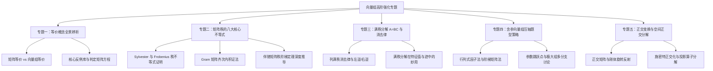

# 第3讲 向量组：考研高阶冲刺与思维模型

---

## 1. 专题一：矩阵等价、向量组等价与线性表出的全景辨析

### 1.1 核心概念内涵对比表
>[1] **概念对比与判定条件**
>
>> | 概念类型 | 对象与前提 | 充分必要条件 | 几何本质 |
| :--- | :--- | :--- | :--- |
| **矩阵等价** ($A \cong B$) | $A, B$ 必须为**同型矩阵** ($m \times n$) | $r(A) = r(B)$（存在可逆阵 $P, Q$ 使 $PAQ = B$） | 两矩阵为同一个线性映射在不同基下的表示 |
| **向量组等价** ($(I) \cong (II)$) | 向量维数相同（同属 $\mathbb{R}^n$），个数可不同 | $r(I) = r(II) = r(I, II)$（能相互线性表出） | 两向量组生成的子空间完全重合：$\text{span}(I) = \text{span}(II)$ |
| **线性表出** ($(II)$ 可由 $(I)$ 表出) | 向量维数相同 | $r(I) = r(I, II)$（或 $\text{span}(II) \subseteq \text{span}(I)$） | 向量组 $(II)$ 落在向量组 $(I)$ 的生成子空间内部 |

>[2] **三大核心误区与反例库**
>
>> (1) **误区一：$r(A) = r(B) \implies$ 列向量组等价？【错误！】**
>
>> 反例：设 $A = \begin{bmatrix} 1 & 0 \\ \\ 0 & 1 \\ \\ 0 & 0 \end{bmatrix}, B = \begin{bmatrix} 0 & 0 \\ \\ 1 & 0 \\ \\ 0 & 1 \end{bmatrix}$。
>
>> 此时 $r(A) = r(B) = 2$，作为矩阵满足 $A \cong B$（矩阵等价）。
>
>> 但 $A$ 的列生成 $xy$ 平面，$B$ 的列生成 $yz$ 平面，二者显然不能相互线性表出，列向量组不等价！
>
>> (2) **误区二：向量组等价 $\implies$ 矩阵等价？【错误！】**
>
>> 反例：设 $\alpha_1 = [1, 0]^T, \alpha_2 = [0, 1]^T$（对应矩阵 $A_{2 \times 2}$）；$\beta_1 = [1, 0]^T, \beta_2 = [0, 1]^T, \beta_3 = [1, 1]^T$（对应矩阵 $B_{2 \times 3}$）。
>
>> 两向量组生成的空间均为 $\mathbb{R}^2$，向量组等价；但 $A$ 为 $2 \times 2$ 方阵，$B$ 为 $2 \times 3$ 矩阵，型号不同，根本不存在矩阵等价的前提！
>
>> (3) **误区三：单向线性表出 $\implies$ 向量组等价？【错误！】**
>
>> 反例：$\alpha_1 = [1, 0]^T, \alpha_2 = [0, 1]^T$ 与 $\beta = [1, 0]^T$。$\beta$ 可由 $\alpha_1, \alpha_2$ 线性表出，但 $\alpha_2$ 无法由 $\beta$ 表出，单向包含不等于等价。

---

## 2. 专题二：矩阵秩的八大核心不等式及其代数与几何深度证明

### 2.1 乘积秩不等式与西尔维斯特（Sylvester）秩不等式
>[1] **乘积秩不等式**
>
>> $$
r(AB) \le \min\{r(A), r(B)\}
$$
>
>> 几何证明思想：$AB$ 对应线性变换的复合映射。
>
>> 像空间包含关系：$\text{Im}(AB) \subseteq \text{Im}(A) \implies \dim\text{Im}(AB) \le \dim\text{Im}(A) \implies r(AB) \le r(A)$。
>
>> 类似地，由核空间包含关系或转置性质立即可得 $r(AB) \le r(B)$。
>
>[2] **西尔维斯特（Sylvester）秩不等式**
>
>> 设 $A_{m \times n}, B_{n \times s}$，证明：
>
>> $$
r(AB) \ge r(A) + r(B) - n
$$
>
>> **代数证明（分块矩阵初等变换法）**：
>
>> (1) 构造 $(m+n) \times (n+s)$ 分块矩阵：
>
>> $$
M = \begin{bmatrix} E_n & O \\ \\ A & AB \end{bmatrix}
$$
>
>> (2) 对 $M$ 实施初等行变换：用第 1 行块的 $A$ 倍减去第 2 行块：
>
>> $$
\begin{bmatrix} E_n & O \\ \\ -A & E_m \end{bmatrix} \begin{bmatrix} E_n & O \\ \\ A & AB \end{bmatrix} = \begin{bmatrix} E_n & O \\ \\ O & AB \end{bmatrix}
$$
>
>> 从而得到：$r(M) = r(E_n) + r(AB) = n + r(AB)$。
>
>> (3) 另一方面，对 $M$ 实施初等列变换：用第 1 列块的 $B$ 倍加到第 2 列块：
>
>> $$
\begin{bmatrix} E_n & O \\ \\ A & AB \end{bmatrix} \begin{bmatrix} E_n & B \\ \\ O & E_s \end{bmatrix} = \begin{bmatrix} E_n & B \\ \\ A & AB + AB \end{bmatrix}
$$
>
>> 更直观地，直接构造分块初等变换矩阵：
>
>> $$
\begin{bmatrix} E_n & O \\ \\ -A & E_m \end{bmatrix} \begin{bmatrix} E_n & B \\ \\ A & O \end{bmatrix} = \begin{bmatrix} E_n & B \\ \\ O & -AB \end{bmatrix}
$$
>
>> 两边计算秩：
>
>> $$
r\left(\begin{bmatrix} E_n & B \\ \\ A & O \end{bmatrix}\right) = r\left(\begin{bmatrix} E_n & B \\ \\ O & -AB \end{bmatrix}\right) = n + r(AB)
$$
>
>> 而对左侧矩阵作分块行变换：
>
>> $$
r\left(\begin{bmatrix} E_n & B \\ \\ A & O \end{bmatrix}\right) \ge r(A) + r(B)
$$
>
>> 整理即得：$r(AB) \ge r(A) + r(B) - n$。
>
>[3] **零乘积特例与基础解系推论**
>
>> 若 $AB = O$，则 $r(AB) = 0$。代入西尔维斯特不等式得：
>
>> $$
0 \ge r(A) + r(B) - n \implies r(A) + r(B) \le n
$$
>
>> 这一推论在考研中是判定矩阵乘积为零的核心工具（$B$ 的列向量全为 $Ax = \mathbf{0}$ 的解）。

---

### 2.2 弗罗贝尼乌斯（Frobenius）秩不等式
>[1] **不等式表述**
>
>> 设 $A, B, C$ 为可乘相容矩阵，则：
>
>> $$
r(ABC) \ge r(AB) + r(BC) - r(B)
$$

>[2] **分块构造法证明**
>
>> 设 $B$ 的秩为 $r$，由满秩分解定理，存在列满秩矩阵 $B_1$ 和行满秩矩阵 $B_2$ 使得 $B = B_1 B_2$。
>
>> 结合西尔维斯特不等式应用于 $(AB_1)(B_2C)$，即可严格推出弗罗贝尼乌斯不等式。
>
>> 当取 $B = E_n$ 时，弗罗贝尼乌斯不等式即退化为经典的西尔维斯特不等式。

---

### 2.3 格拉姆（Gram）矩阵内积秩恒等式
>[1] **定理表述**
>
>> 设 $A$ 为实数域上的任意 $m \times n$ 矩阵，则：
>
>> $$
r(A^T A) = r(A A^T) = r(A) = r(A^T)
$$

>[2] **基于齐次方程同解性的严谨证明**
>
>> 证明 $Ax = \mathbf{0}$ 与 $A^TA x = \mathbf{0}$ 为**同解方程组**：
>
>> (1) 若 $Ax = \mathbf{0}$，两边左乘 $A^T$ 得 $A^T A x = A^T \mathbf{0} = \mathbf{0}$，故 $Ax = \mathbf{0}$ 的解必为 $A^TAx = \mathbf{0}$ 的解。
>
>> (2) 反之，若 $A^TA x = \mathbf{0}$，两边左乘 $x^T$：
>
>> $$
x^T (A^T A x) = 0 \implies (Ax)^T (Ax) = 0
$$
>
>> 记向量 $y = Ax \in \mathbb{R}^m$，则 $y^T y = \sum_{i=1}^m y_i^2 = 0$。
>
>> 在实数域上，平方和为零必有每一分量为零，即：
>
>> $$
y = Ax = \mathbf{0}
$$
>
>> 这表明 $A^TAx = \mathbf{0}$ 的解亦必为 $Ax = \mathbf{0}$ 的解。
>
>> (3) 综上，$Ax = \mathbf{0}$ 与 $A^TAx = \mathbf{0}$ 是同解方程组，它们的基础解系所含向量个数完全相同：
>
>> $$
n - r(A) = n - r(A^TA) \implies r(A^TA) = r(A)
$$
>
>> 对 $A^T$ 代替 $A$ 重复上述步骤，立即可得 $r(AA^T) = r(A^T) = r(A)$。

---

## 3. 专题三：满秩分解 $A = BC$ 与列满秩/行满秩消去律

### 3.1 满秩分解的理论构造与性质
>[1] **构造定理**
>
>> 设 $A_{m \times n}$ 且 $r(A) = r > 0$。
>
>> (1) 对 $A$ 施以初等行变换化为行最简阶梯形矩阵 $R$。
>
>> (2) 取 $A$ 中对应 $R$ 中主元所在的 $r$ 个列向量构成 $m \times r$ 矩阵 $B$（$B$ 为列满秩矩阵，即 $r(B) = r$）。
>
>> (3) 取 $R$ 中的 $r$ 个非零行构成 $r \times n$ 矩阵 $C$（$C$ 为行满秩矩阵，即 $r(C) = r$）。
>
>> 则矩阵分解式 $A = BC$ 恒成立。
>
>[2] **列满秩消去律与左可逆性**
>
>> 若 $B_{m \times r}$ 为列满秩矩阵（$r(B) = r \le m$）：
>
>> (1) 格拉姆矩阵 $B^TB$ 为 $r$ 阶实对称方阵，且 $r(B^TB) = r(B) = r$，故 $B^TB$ 严格可逆。
>
>> (2) 构造左逆矩阵 $B_L^+ = (B^TB)^{-1}B^T$，满足：
>
>> $$
B_L^+ B = (B^TB)^{-1}(B^TB) = E_r
$$
>
>> (3) **列满秩消去律**：若 $BX = BY$，两边左乘 $B_L^+$ 即得：
>
>> $$
BX = BY \implies X = Y
$$

>[3] **行满秩消去律与右可逆性**
>
>> 若 $C_{r \times n}$ 为行满秩矩阵（$r(C) = r \le n$）：
>
>> 类似地，$C C^T$ 可逆，存在右逆 $C_R^+ = C^T (CC^T)^{-1}$，满足 $C C_R^+ = E_r$。
>
>> **行满秩消去律**：若 $XC = YC$，两边右乘 $C_R^+$ 即得：
>
>> $$
XC = YC \implies X = Y
$$

---

### 3.2 满秩分解在特征值与迹中的强力妙用
>[1] **非零特征值恒等定理**
>
>> 对于任意相容矩阵 $B_{m \times r}$ 与 $C_{r \times n}$，乘积矩阵 $BC$ 与 $CB$ 具有完全相同的非零特征值及其重数：
>
>> $$
\lambda^{r} \det(\lambda E_m - BC) = \lambda^{m} \det(\lambda E_r - CB)
$$
>
>> 特别地，对于秩为 1 的矩阵（$A = \alpha \beta^T$），满秩分解为列向量 $\alpha$ 与行向量 $\beta^T$：
>
>> $A$ 的特征值极为明了：一个非零特征值为 $\text{tr}(A) = \beta^T \alpha$，其余 $n-1$ 个特征值全为 0！
>
>[2] **迹的轮换不变性**
>
>> $$
\text{tr}(BC) = \text{tr}(CB)
$$
>
>> 当计算高阶低秩矩阵的特征多项式或迹时，通过将 $A$ 转化为低阶方阵 $CB$，能够实现维度的极大化简。

---

## 4. 专题四：含参向量组压轴题型的分类突破模型

### 4.1 含参向量组判定的思维流
>[1] **第一步：维度与个数校验**
>
>> (1) 若向量个数 $s >$ 维数 $n$：无需任何计算，直接秒杀判定向量组线性相关！
>
>> (2) 若向量个数 $s = n$：构造方阵行列式 $|A|$。令 $|A| = 0$ 解出所有临界参数点 $\lambda_1, \dots, \lambda_k$。
>
>> 在非临界点（$|A| \ne 0$）直接判定线性无关；在临界点代入做初等行变换。
>
>> (3) 若向量个数 $s < n$：矩阵为窄长矩阵，直接运用初等行变换化为阶梯形，根据非零行数是否等于 $s$ 讨论参数。
>
>[2] **第二步：增广矩阵阶梯化分类讨论三步法**
>
>> 对于线性表出方程组 $[A \mid \beta]$：
>
>> (1) 通过初等行变换将参数尽量汇聚到对角线与最末一行。
>
>> (2) 区分主元系数为零的奇异点：代入具体数值，直观对比 $r(A)$ 与 $r(A, \beta)$。
>
>> (3) 结论判定口诀：
>
>> - $r(A) < r(A, \beta)$：无解，不能线性表出；
>
>> - $r(A) = r(A, \beta) = s$：唯一解，能唯一线性表出；
>
>> - $r(A) = r(A, \beta) < s$：无穷多解，线性表出不唯一。

---

## 5. 专题五：正交变换与空间正交分解的高观点透视

### 5.1 正交矩阵的刚体运动几何本质
>[1] **二维正交变换的分类定理**
>
>> 任意 2 阶实正交矩阵 $Q$ 必属于以下两类之一：
>
>> (1) **旋转矩阵（刚体旋转）**：$|Q| = 1$
>
>> $$
Q = \begin{bmatrix} \cos\theta & -\sin\theta \\ \\ \sin\theta & \cos\theta \end{bmatrix}
$$
>
>> (2) **镜像反射矩阵（翻转反射）**：$|Q| = -1$
>
>> $$
Q = \begin{bmatrix} \cos\theta & \sin\theta \\ \\ \sin\theta & -\cos\theta \end{bmatrix}
$$
>
>> 反射变换具有轴对称几何意义，其平方等于单位阵 $Q^2 = E$。

---

### 5.2 施密特正交化的投影矩阵（算子）视角
>[1] **正交投影算子**
>
>> 设 $\beta$ 为非零向量，任意向量 $\alpha$ 在 $\beta$ 方向上的正交投影分量为：
>
>> $$
P_\beta \alpha = \frac{(\alpha, \beta)}{(\beta, \beta)}\beta = \frac{\beta^T\alpha}{\beta^T\beta}\beta = \left(\frac{\beta\beta^T}{\beta^T\beta}\right)\alpha
$$
>
>> 矩阵 $P = \frac{\beta\beta^T}{\beta^T\beta}$ 称为 **投影矩阵**，它具有对称性（$P^T = P$）与幂等性（$P^2 = P$）。
>
>> 施密特正交化第 2 步实质为：$\beta_2 = (E - P_{\beta_1})\alpha_2$。
>
>> 其中 $E - P_{\beta_1}$ 为向 $\beta_1$ 的正交补空间投影的投影算子。
>
>[2] **空间正交分解定理（直和分解）**
>
>> 设 $W$ 是 $\mathbb{R}^n$ 的一个子空间，$W^\perp$ 为 $W$ 的正交补空间（即所有与 $W$ 中每个向量均正交的向量集合）：
>
>> 则全空间可正交直和分解为：
>
>> $$
\mathbb{R}^n = W \oplus W^\perp
$$
>
>> 且有维数恒等式：
>
>> $$
\dim W + \dim W^\perp = n
$$
>
>> 考研实对称矩阵不同特征值对应的特征子空间天然相互正交，正是这一深刻空间正交结构的集中体现。
