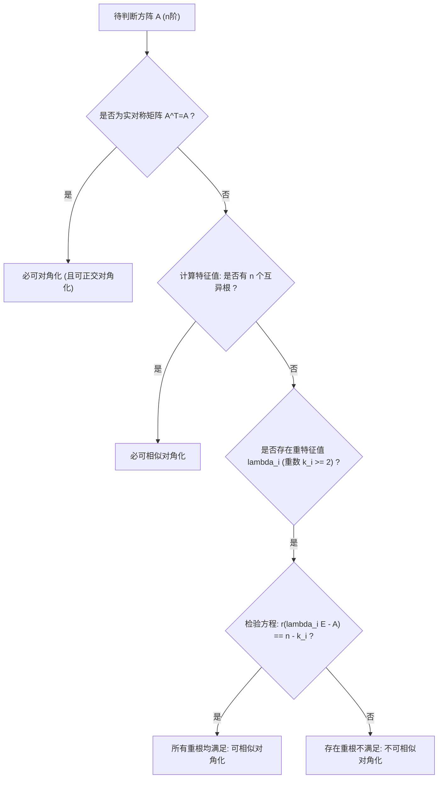

# 第五章 特征值与特征向量·考研高阶冲刺与深水区强化

## 知识框架拓扑

```mermaid
graph TD
    A["特征值与特征向量深水区强化"] --> B["代数重数与几何重数深度不等式"]
    A --> C["矩阵相似对角化六大模型与决策树"]
    A --> D["实对称矩阵正交谱分解定理"]
    A --> E["矩阵相似判定七步黄金攻防策略"]
    A --> F["同时对角化与可交换矩阵谱理论"]
    A --> G["Cayley-Hamilton与极小多项式"]
    A --> H["左右特征向量拓扑与对偶结构"]
    A --> I["循环矩阵与反对称矩阵解析模型"]

    B --> B1["代数重数k_i与特征方程根"]
    B --> B2["几何重数s_i=n-r(lambda E-A)"]
    B --> B3["基础不等式链1 <= s_i <= k_i"]

    C --> C1["互异单根与实对称天然对角化"]
    C --> C2["秩1外积阵可对角化充要判定"]
    C --> C3["幂等阵A^2=A与幂零阵A^k=O"]

    D --> D1["谱分解A=sum lambda_i q_i q_i^T"]
    D --> D2["正交投影算子性质P_i P_j = delta_ij P_i"]
    D --> D3["矩阵高次幂与函数演算"]

    E --> E1["不变量初筛排除"]
    E --> E2["实对称矩阵特征值全同准则"]
    E --> E3["特征矩阵秩与初等因子匹配"]

    F --> F1["AB=BA充要定理"]
    F --> F2["公共特征向量空间"]

    G --> G1["零化多项式与特征降次"]
    G --> G2["极小多项式无重根等价对角化"]

    H --> H1["左右特征向量对偶正交性"]
    H --> H2["伴随阵与逆阵特征向量共线性"]

    I --> I1["循环矩阵单位根离散傅里叶谱"]
    I --> I2["反对称矩阵纯虚特征值定理"]
```

---

## 1. 代数重数与几何重数的代数几何拓扑深度不等式

### 1.1 代数重数与几何重数的本质界定

###### **定义[1]: 两类重数的代数与几何根基**

>[1] **代数重数 (Algebraic Multiplicity, $k_i$)**：
>
>设 $\lambda_i$ 为方阵 $A$ 的特征值，在特征多项式因式分解式：
>
>$$f(\lambda) = |\lambda E - A| = (\lambda - \lambda_1)^{k_1} (\lambda - \lambda_2)^{k_2} \dots (\lambda - \lambda_m)^{k_m}$$
>
>中，根 $(\lambda - \lambda_i)$ 的指数 $k_i$ 称为特征值 $\lambda_i$ 的 **代数重数**。它从多项式代数根的重数角度描述了特征值的重合度，满足 $\sum_{i=1}^m k_i = n$。
>
>[2] **几何重数 (Geometric Multiplicity, $s_i$)**：
>
>特征值 $\lambda_i$ 对应的齐次线性方程组 $(\lambda_i E - A)x = 0$ 的基础解系所含解向量个数：
>
>$$s_i = \dim(\text{Null}(\lambda_i E - A)) = n - r(\lambda_i E - A)$$
>
>称为特征值 $\lambda_i$ 的 **几何重数**。它从空间拓扑角度度量了特征子空间 $V_{\lambda_i}$ 的维数。

### 1.2 几何重数与代数重数的基本不等式链

###### **定理[1]: 经典重数基本不等式**

>[1] 不等式表述：
>
>对任意方阵 $A$ 的任意特征值 $\lambda_i$，其几何重数 $s_i$ 与代数重数 $k_i$ 严格满足：
>
>$$1 \le s_i = n - r(\lambda_i E - A) \le k_i$$
>
>[2] 核心推论与若尔当结构对应：
>
>>(1) 单特征值（$k_i = 1$）必满足 $s_i = 1$，即单特征值的几何重数严格等于 1，绝无亏损；
>
>>(2) 亏格 (Geometric Deficiency) $\delta_i = k_i - s_i \ge 0$ 度量了矩阵偏离可对角化的缺陷程度；
>
>>(3) 在若尔当标准型中，$s_i$ 恰好等于对应于特征值 $\lambda_i$ 的若尔当块 (Jordan Blocks) 的总个数；而各若尔当块阶数之和等于代数重数 $k_i$。

---

## 2. 矩阵相似对角化的六大判别模型与考研决策树

### 2.1 考研六大对角化判别模型

###### **定理[1]: 对角化六大判别模型**

>[1] **模型一：互异特征值模型（单根充分条件）**：
>
>若 $n$ 阶方阵 $A$ 在复数域（或实数域）内有 $n$ 个互不相同的特征值，则 $A$ 必可相似对角化。
>
>[2] **模型二：实对称矩阵模型（实对称特权充分条件）**：
>
>若 $A$ 为实对称矩阵（$A^{\mathrm{T}} = A$），则 $A$ 必可正交相似对角化（每个重特征值的几何重数恒等于代数重数）。
>
>[3] **模型三：重根几何重数模型（充要判别标准）**：
>
>设 $A$ 的全部特征值为 $\lambda_1, \dots, \lambda_m$，其代数重数分别为 $k_1, \dots, k_m$。方阵 $A$ 可对角化 $\iff$ 对每一个重特征值（$k_i \ge 2$），恒有：
>
>$$r(\lambda_i E - A) = n - k_i \iff n - r(\lambda_i E - A) = k_i$$
>
>[4] **模型四：秩 1 矩阵模型（外积矩阵充要判别）**：
>
>设 $A = \alpha \beta^{\mathrm{T}} \ne O$ 为 $n$ 阶秩 1 矩阵。
>
>>(1) 若 $\text{tr}(A) = \beta^{\mathrm{T}}\alpha \ne 0 \iff A$ 可相似对角化（相似于 $\text{diag}(\text{tr} A, 0, \dots, 0)$）；
>
>>(2) 若 $\text{tr}(A) = \beta^{\mathrm{T}}\alpha = 0 \iff A$ 绝不可对角化（此时 $A^2 = O$，为非零幂零矩阵）。
>
>[5] **模型五：幂等矩阵模型（投影算子对角化）**：
>
>若方阵满足 $A^2 = A$（幂等矩阵），则 $A$ 的特征值只能为 0 或 1，且 $A$ 必可相似对角化，相似于 $\text{diag}(E_r, O_{n-r})$，其中 $r = r(A) = \text{tr}(A)$。
>
>[6] **模型六：幂零矩阵模型（非零必不可对角化）**：
>
>若方阵满足 $A^k = O$（幂零矩阵），则其全部特征值全为 0。
>
>>(1) 若 $A = O$，平凡对角阵；
>
>>(2) 若 $A \ne O$，则 $A$ 绝不可相似对角化（若可对角化，则相似于零阵，推出 $A = O$，矛盾）。

### 2.2 考研对角化快速判断决策树

---

## 3. 实对称矩阵的正交谱分解定理（Spectral Decomposition）

### 3.1 正交谱分解定理

###### **定理[1]: 谱分解公式与正交投影算子**

>[1] 谱分解定理表述：
>
>设 $A$ 为 $n$ 阶实对称矩阵，其特征值为 $\lambda_1, \lambda_2, \dots, \lambda_n$，对应的单位正交特征向量组为 $q_1, q_2, \dots, q_n$。
>
>则矩阵 $A$ 具有唯一的正交谱分解：
>
>$$A = Q \Lambda Q^{\mathrm{T}} = \sum_{i=1}^n \lambda_i q_i q_i^{\mathrm{T}}$$
>
>若矩阵 $A$ 有 $m$ 个互不相同的特征值 $\mu_1, \dots, \mu_m$，则谱分解可合并为：
>
>$$A = \sum_{j=1} ^m \mu_j P_j$$
>
>其中 $P_j = \sum_{q \in S_j} q q^{\mathrm{T}}$ 为到特征子空间 $V_{\mu_j}$ 上的正交投影矩阵。
>
>[2] 正交投影算子的四大核心性质：
>
>>(1) **对称性**：$P_j^{\mathrm{T}} = P_j$；
>
>>(2) **幂等性**：$P_j^2 = P_j$；
>
>>(3) **正交互斥性**：$P_j P_k = O$ ($j \ne k$)；
>
>>(4) **完全恒等性（单位分解）**：$\sum_{j=1}^m P_j = E$。

### 3.2 谱分解在矩阵函数运算中的极速应用

###### **方法[1]: 利用谱分解计算高次幂与矩阵多项式**

>[1] 矩阵高次幂计算：
>
>由于投影算子的正交幂等性（$P_j P_k = \delta_{jk} P_j$），矩阵高次幂可直接逐项作用：
>
>$$A^k = \left( \sum_{j=1}^m \mu_j P_j \right)^k = \sum_{j=1}^m \mu_j^k P_j$$
>
>[2] 矩阵分析函数演算：
>
>对任意在矩阵谱上收敛的函数 $f(x)$（如多项式、逆矩阵、指数矩阵 $e^A$）：
>
>$$f(A) = \sum_{j=1}^m f(\mu_j) P_j$$

---

## 4. 矩阵相似判定（$A \sim B$）的七步黄金攻防策略

### 4.1 七步相似攻防判别准则

###### **方法[1]: 七步排查流程**

>[1] **第一步：九大不变量初筛排除（快速否定）**：
>
>计算并对比两矩阵的必要不变量：秩 $r$、行列式 $|M|$、迹 $\text{tr}$、特征多项式 $|\lambda E - M|$。
>
>若有任一不变量不相等，立即判定 $A \not\sim B$。
>
>[2] **第二步：实对称矩阵判定法（终极武器）**：
>
>若矩阵 $A$ 与 $B$ 均为实对称矩阵，则：
>
>$$A \sim B \iff A \text{ 与 } B \text{ 的特征值完全相同}$$
>
>[3] **第三步：同可对角化判定法**：
>
>若矩阵 $A$ 与 $B$ 均可相似对角化，则：
>
>$$A \sim B \iff A \sim \Lambda \text{ 且 } B \sim \Lambda \iff A \text{ 与 } B \text{ 拥有相同的特征值}$$
>
>[4] **第四步：一可对角化一不可对角化排除法**：
>
>若 $A$ 可相似对角化，而 $B$ 不可相似对角化，则必然 $A \not\sim B$。
>
>[5] **第五步：特征矩阵秩检验法**：
>
>若两矩阵均不可对角化，进一步计算公共重特征值 $\lambda_0$ 处的特征矩阵秩：
>
>$$A \sim B \implies r(\lambda_0 E - A) = r(\lambda_0 E - B)$$
>
>若秩不相等，则必然 $A \not\sim B$。
>
>[6] **第六步：极小多项式匹配法**：
>
>检查方阵 $A$ 与 $B$ 的极小多项式是否完全相同：$m_A(\lambda) = m_B(\lambda)$。
>
>[7] **第七步：若尔当标准型终极一致性判定**：
>
>在复数域内，$A \sim B \iff A$ 与 $B$ 拥有完全一致的若尔当标准型（初等因子组完全相同）。

---

## 5. 同时对角化定理与可交换矩阵（$AB=BA$）的谱特征

### 5.1 同时对角化定理

###### **定理[1]: 同时对角化充要条件**

>[1] 定理表述：
>
>设 $A, B$ 是两个可相似对角化的 $n$ 阶方阵。则存在同一个可逆矩阵 $P$，使得：
>
>$$P^{-1} A P = \Lambda_A \quad \text{且} \quad P^{-1} B P = \Lambda_B$$
>
>同时为对角矩阵的充要条件是：矩阵 $A$ 与 $B$ 可交换，即：
>
>$$A B = B A$$
>
>[2] 实对称矩阵的同时正交对角化：
>
>设 $A, B$ 是两个实对称矩阵，则存在同一个正交矩阵 $Q$ 使得 $Q^{\mathrm{T}}AQ$ 与 $Q^{\mathrm{T}}BQ$ 同时为对角阵的充要条件是 $AB = BA$。

### 5.2 可交换矩阵的核心谱推论

###### **定理[2]: $AB=BA$ 的代数结构定理**

>[1] 谱分离定理：
>
>若 $AB = BA$，则 $A$ 的每一个特征子空间 $V_\lambda$ 都是矩阵 $B$ 的 **不变子空间**（即 $x \in V_\lambda \implies Bx \in V_\lambda$）。
>
>[2] 矩阵多项式表示定理：
>
>设 $n$ 阶方阵 $A$ 拥有 $n$ 个互不相同的特征值。若方阵 $B$ 满足 $AB = BA$，则矩阵 $B$ 必可唯一表示为矩阵 $A$ 的一个次数不超过 $n-1$ 次的多项式：
>
>$$B = c_0 E + c_1 A + c_2 A^2 + \dots + c_{n-1} A^{n-1}$$

---

## 6. Cayley-Hamilton 定理与极小多项式深水区运用

### 6.1 Cayley-Hamilton 定理

###### **定理[1]: 矩阵特征多项式零化定理**

>[1] 定理表述：
>
>设 $f(\lambda) = |\lambda E - A| = \lambda^n + c_{n-1}\lambda^{n-1} + \dots + c_1\lambda + c_0$ 是方阵 $A$ 的特征多项式，则矩阵 $A$ 满足自身的特征方程：
>
>$$f(A) = A^n + c_{n-1} A^{n-1} + \dots + c_1 A + c_0 E = O$$
>
>[2] 矩阵求逆降阶公式：
>
>若方阵 $A$ 可逆（$c_0 = (-1)^n |A| \ne 0$），移项直接给出逆矩阵的矩阵多项式展开：
>
>$$A^{-1} = -\frac{1}{c_0} (A^{n-1} + c_{n-1}A^{n-2} + \dots + c_1 E)$$

### 6.2 极小多项式与可对角化深水区准则

###### **定理[2]: 极小多项式无重根判定准则**

>[1] 极小多项式定义：
>
>使 $m(A) = O$ 成立的次数最低、首项系数为 1 的非零多项式 $m(\lambda)$ 称为矩阵 $A$ 的 **极小多项式 (Minimal Polynomial)**。
>
>[2] 极小多项式两大性质：
>
>>(1) 极小多项式整除特征多项式：$f(\lambda) = q(\lambda) m(\lambda)$；
>
>>(2) 极小多项式的根与特征多项式的根完全相同（仅根的重数可能更低）。
>
>[3] 高阶可对角化充要准则：
>
>方阵 $A$ 可相似对角化 $\iff$ 矩阵 $A$ 的极小多项式 $m(\lambda)$ 在数域内 无重根（即极小多项式分解为一次互异单因式的乘积）：
>
>$$m(\lambda) = (\lambda - \lambda_1)(\lambda - \lambda_2)\dots(\lambda - \lambda_m) \quad (\lambda_i \text{ 互不相等})$$

---

## 7. 伴随矩阵、转置矩阵与逆矩阵的特征向量拓扑关联

### 7.1 左右特征向量的对偶正交结构

###### **定理[1]: 左右特征向量正交性定理**

>[1] 定义：
>
>满足 $A \xi = \lambda \xi$ ($\xi \ne 0$) 的列向量 $\xi$ 称为 **右特征向量**；
>
>满足 $\eta^{\mathrm{T}} A = \mu \eta^{\mathrm{T}}$ ($\eta \ne 0$) 的列向量 $\eta$ 称为 **左特征向量**（即 $A^{\mathrm{T}}\eta = \mu\eta$）。
>
>[2] 互异特征值的左右特征向量正交定理：
>
>若 $\lambda \ne \mu$，则矩阵 $A$ 属于 $\lambda$ 的右特征向量 $\xi$ 与属于 $\mu$ 的左特征向量 $\eta$ 必严格正交：
>
>$$\eta^{\mathrm{T}} \xi = 0$$
>
>证明：$\mu (\eta^{\mathrm{T}} \xi) = (\eta^{\mathrm{T}} A) \xi = \eta^{\mathrm{T}} (A\xi) = \lambda (\eta^{\mathrm{T}} \xi) \implies (\lambda - \mu)(\eta^{\mathrm{T}}\xi) = 0$。由 $\lambda \ne \mu$ 得 $\eta^{\mathrm{T}}\xi = 0$。

### 7.2 伴随矩阵与逆矩阵特征向量的共线性

###### **定理[2]: 逆矩阵与伴随矩阵特征向量恒同定理**

>[1] 伴随与逆矩阵特征向量一致性：
>
>设方阵 $A$ 可逆，特征值为 $\lambda$，对应特征向量为 $\xi$。则：
>
>>(1) 逆矩阵 $A^{-1}$ 属于特征值 $\frac{1}{\lambda}$ 的特征向量仍为 $\xi$；
>
>>(2) 伴随矩阵 $A^*$ 属于特征值 $\frac{|A|}{\lambda}$ 的特征向量仍为 $\xi$。
>
>即：$A, A^{-1}, A^*$ 共享完全相同的特征向量集合。

---

## 8. 循环矩阵、反称矩阵与外积矩阵的特征值显式通项解析模型

### 8.1 循环矩阵的离散傅里叶谱模型

###### **模型[1]: 循环矩阵特征值公式**

>[1] 循环矩阵结构：
>
>形如 $C = \begin{bmatrix} c_0 & c_1 & \dots & c_{n-1} \\ c_{n-1} & c_0 & \dots & c_{n-2} \\ \vdots & \vdots & \ddots & \vdots \\ c_1 & c_2 & \dots & c_0 \end{bmatrix}$ 的矩阵称为 **循环矩阵 (Circulant Matrix)**。
>
>[2] 显式特征值通项公式：
>
>令 $\omega_k = e^{\mathrm{i} \frac{2\pi k}{n}} = \cos\frac{2\pi k}{n} + \mathrm{i}\sin\frac{2\pi k}{n}$ ($k = 0, 1, \dots, n-1$) 为 $n$ 次单位根。
>
>则循环矩阵 $C$ 的全部 $n$ 个特征值由离散傅里叶变换显式给出：
>
>$$\lambda_k = \sum_{j=0}^{n-1} c_j \omega_k^j = c_0 + c_1 \omega_k + c_2 \omega_k^2 + \dots + c_{n-1} \omega_k^{n-1} \quad (k = 0, 1, \dots, n-1)$$

### 8.2 反称矩阵的纯虚谱性质

###### **模型[2]: 反对称矩阵代数性质**

>[1] 定义：
>
>满足 $A^{\mathrm{T}} = -A$ 的实数方阵称为 **反对称矩阵 (Skew-symmetric Matrix)**。
>
>[2] 谱特权定理：
>
>>(1) 反对称矩阵的实特征值只能为 0；复特征值必为 **纯虚数**（形如 $\pm \mathrm{i} b$）；
>
>>(2) 奇数阶实反对称矩阵必有零特征值，故奇数阶反对称矩阵行列式恒为零：
>
>$$|A| = |A^{\mathrm{T}}| = |-A| = (-1)^n |A| \implies |A| = 0 \quad (\text{当 } n \text{ 为奇数})$$
>
>>(3) 任意阶实反对称矩阵的秩必为 **偶数**：$r(A) = 2k$。
>
