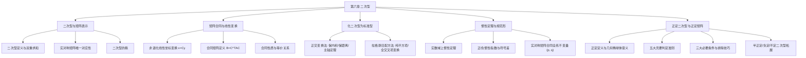
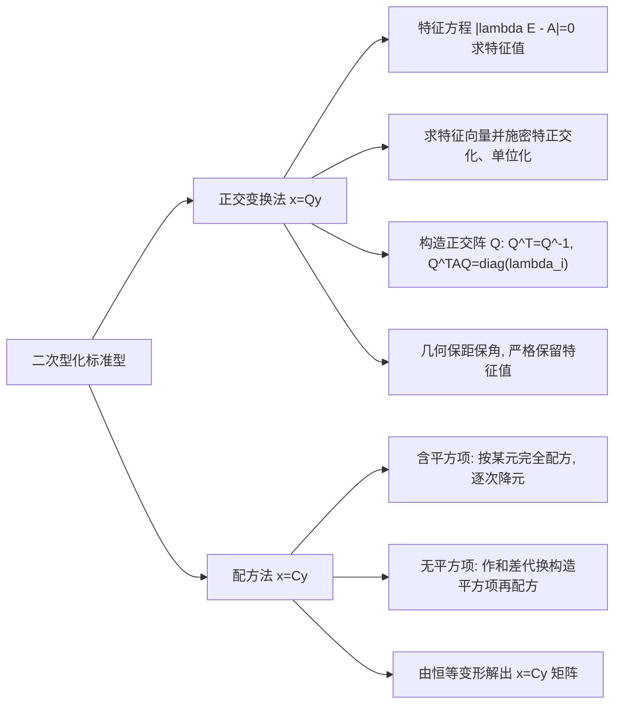

# 第六章 二次型 (Quadratic Forms)

## 知识导航体系

---

## 1. 二次型的基本概念与矩阵表示

### 1.1 二次型的定义

含有 $n$ 个变量 $x_1, x_2, \dots, x_n$ 的二次齐次多项式称为 **$n$ 元二次型**，简称二次型，一般形式记作：

$$f(x_1, x_2, \dots, x_n) = \sum_{i=1}^n \sum_{j=1}^n a_{ij} x_i x_j = a_{11}x_1^2 + a_{22}x_2^2 + \dots + a_{nn}x_n^2 + 2\sum_{1 \le i < j \le n} a_{ij} x_i x_j$$

### 1.2 二次型的矩阵形式

###### **定义[1]: 二次型的对称矩阵表示**

任一二次型均可唯一表示为向量与对称矩阵的二次齐次积：

$$f(x) = x^{\mathrm{T}} A x$$

其中列向量 $x$ 与矩阵 $A$ 分别为：

$$x = \begin{bmatrix} x_1 \\ \\ x_2 \\ \\ \vdots \\ \\ x_n \end{bmatrix}, \quad A = \begin{bmatrix} a_{11} & a_{12} & \cdots & a_{1n} \\ \\ a_{21} & a_{22} & \cdots & a_{2n} \\ \\ \vdots & \vdots & \ddots & \vdots \\ \\ a_{n1} & a_{n2} & \cdots & a_{nn} \end{bmatrix}$$

> 矩阵构造核心法则：
>
> [1] 主对角线元素 $a_{ii}$ 严格等于二次型中纯平方项 $x_i^2$ 的系数。
>
> [2] 非对角线元素 $a_{ij}$ 与 $a_{ji}$ 严格平分交叉乘积项 $x_i x_j$ 的系数，即令 $a_{ij} = a_{ji} = \frac{1}{2} \text{coeff}(x_i x_j)$。
>
> [3] 实二次型对应的矩阵 $A$ 必须且只能约定为 **实对称矩阵**（$A^{\mathrm{T}} = A$），这种对应关系是 一一对应 的。

###### **定义[2]: 二次型的秩**

二次型 $f(x) = x^{\mathrm{T}} A x$ 的矩阵 $A$ 的秩 $r(A)$ 称为该二次型的秩，记作：

$$r(f) = r(A)$$

若 $r(A) = n$，称二次型为非退化的；若 $r(A) < n$，称二次型为退化的。

---

## 2. 线性变换与矩阵合同

### 2.1 坐标变换模型

设 $x_1, \dots, x_n$ 与一组新变量 $y_1, \dots, y_n$ 之间存在非退化线性代换：

$$\begin{cases} x_1 = c_{11}y_1 + c_{12}y_2 + \dots + c_{1n}y_n \\ \\ x_2 = c_{21}y_1 + c_{22}y_2 + \dots + c_{2n}y_n \\ \\ \ \ \vdots \\ \\ x_n = c_{n1}y_1 + c_{n2}y_2 + \dots + c_{nn}y_n \end{cases} \iff x = C y$$

其中变换矩阵 $C = (c_{ij})_{n \times n}$ 必须满足可逆性条件：$|C| \ne 0$。

将 $x = C y$ 代入原二次型 $f(x) = x^{\mathrm{T}} A x$，可得关于新变量 $y$ 的二次型：

$$g(y) = (Cy)^{\mathrm{T}} A (Cy) = y^{\mathrm{T}} (C^{\mathrm{T}} A C) y = y^{\mathrm{T}} B y$$

新二次型 $g(y)$ 的矩阵为：

$$B = C^{\mathrm{T}} A C$$

### 2.2 矩阵合同的定义与性质

###### **定义[3]: 矩阵合同 (Congruence)**

设 $A, B$ 是数域 $K$ 上的两个 $n$ 阶方阵，若存在可逆矩阵 $C$（$|C| \ne 0$），使得：

$$B = C^{\mathrm{T}} A C$$

则称矩阵 $A$ 与 $B$ **合同**，记作 $A \simeq B$。

###### **性质[1]: 矩阵合同的基本性质**

>[1] 反身性、对称性与传递性：
>
>> (1) 反身性：$A \simeq A$（取 $C = E$）。
>
>> (2) 对称性：若 $A \simeq B$，则 $B \simeq A$（由 $B = C^{\mathrm{T}} A C \implies A = (C^{-1})^{\mathrm{T}} B C^{-1}$）。
>
>> (3) 传递性：若 $A \simeq B$ 且 $B \simeq D$，则 $A \simeq D$。
>
>[2] 保持对称性：若 $A$ 是对称矩阵，则任何与 $A$ 合同的矩阵 $B$ 必为对称矩阵：
>
>$$B^{\mathrm{T}} = (C^{\mathrm{T}} A C)^{\mathrm{T}} = C^{\mathrm{T}} A^{\mathrm{T}} (C^{\mathrm{T}})^{\mathrm{T}} = C^{\mathrm{T}} A C = B$$
>
>[3] 保持矩阵的秩：$r(B) = r(C^{\mathrm{T}} A C) = r(A)$（可逆矩阵相乘不改变秩）。
>
>[4] 保持行列式符号：$|B| = |C^{\mathrm{T}} A C| = |C|^2 |A|$。由于实可逆矩阵满足 $|C|^2 > 0$，故 $|A|$ 与 $|B|$ 同号。

---

## 3. 标准型与规范形

### 3.1 标准型 (Canonical Form)

###### **定义[4]: 二次型的标准型**

只含有变量平方项而没有任何交叉乘积项的二次型称为 **标准型**：

$$f = d_1 y_1^2 + d_2 y_2^2 + \dots + d_n y_n^2$$

其对应的矩阵是对角矩阵 $\Lambda = \text{diag}(d_1, d_2, \dots, d_n)$。

### 3.2 规范形 (Normal Form)

###### **定义[5]: 实二次型的规范形**

在实数域内，平方项系数仅取 $+1, -1, 0$ 的标准型称为实二次型的 **规范形**：

$$f = z_1^2 + z_2^2 + \dots + z_p^2 - z_{p+1}^2 - \dots - z_r^2$$

规范形中：
>[1] 系数为 $+1$ 的项数 $p$ 称为 **正惯性指数**。
>
>[2] 系数为 $-1$ 的项数 $q = r - p$ 称为 **负惯性指数**。
>
>[3] 正负惯性指数之差 $s = p - q$ 称为 **符号差**。
>
>[4] 规范形矩阵为准对角形：$J = \text{diag}(E_p, -E_q, O_{n-r})$。

### 3.3 惯性定理 (Sylvester's Law of Inertia)

###### **定理[1]: 实二次型惯性定理**

任一实二次型 $f(x) = x^{\mathrm{T}} A x$，经过任何可逆实线性变换化为标准型时，其正项项数 $p$ 和负项项数 $q$ 是由实对称矩阵 $A$ 本身唯一确定的，与所采用的可逆线性变换方法完全无关。

###### **定理[2]: 实对称矩阵合同的充要条件**

两个同阶实对称矩阵 $A$ 与 $B$ 合同（$A \simeq B$）的充分必要条件是：

$$A \text{ 与 } B \text{ 具有完全相同的正惯性指数 } p \text{ 和负惯性指数 } q$$

> 考研深度推论：
>
> [1] $A \simeq B \iff p_A = p_B$ 且 $q_A = q_B$。
>
> [2] 秩相同是合同的必要条件（$r = p + q$），但非充分条件。例如 $\text{diag}(1, 1)$ 与 $\text{diag}(1, -1)$ 秩均为 2，但正惯性指数不同，故绝不合同！

---

## 4. 化二次型为标准型的两大方法

化二次型为标准型在考研中主要有两种方法：**正交变换法**（几何保角保距）与 **拉格朗日配方法**（代数坐标变换）。

### 4.1 正交变换法 (Orthogonal Transformation)

###### **定理[3]: 正交变换化二次型定理**

对于任一实对称矩阵 $A$，必存在正交矩阵 $Q$（满足 $Q^{\mathrm{T}} Q = E$，即 $Q^{-1} = Q^{\mathrm{T}}$），使得：

$$Q^{\mathrm{T}} A Q = Q^{-1} A Q = \begin{bmatrix} \lambda_1 & & & O \\ \\ & \lambda_2 & & \\ \\ & & \ddots & \\ \\ O & & & \lambda_n \end{bmatrix}$$

其中 $\lambda_1, \lambda_2, \dots, \lambda_n$ 为矩阵 $A$ 的全部特征值。作正交变换 $x = Q y$，原二次型化为标准型：

$$f = \lambda_1 y_1^2 + \lambda_2 y_2^2 + \dots + \lambda_n y_n^2$$

###### **方法[1]: 正交变换法标准操作流程**

>[1] 写出二次型的实对称矩阵 $A$。
>
>[2] 计算特征多项式 $|\lambda E - A| = 0$，求出矩阵 $A$ 的全部特征值 $\lambda_1, \dots, \lambda_n$。
>
>[3] 对每个特征值 $\lambda_i$，求解齐次线性方程组 $(\lambda_i E - A)x = 0$，求得基础解系：
>
>> (1) 若特征值互不相同，对应的特征向量已天然正交，只需将其单位化。
>
>> (2) 若存在重根特征值，对应的多个线性无关特征向量必须使用 **施密特正交化 (Gram-Schmidt)**，再进行单位化。
>
>[4] 将求得的两两正交的单位特征向量按列拼成正交矩阵 $Q = [\xi_1, \xi_2, \dots, \xi_n]$。
>
>[5] 写出正交变换 $x = Q y$，对应的标准型为 $f = \lambda_1 y_1^2 + \dots + \lambda_n y_n^2$。
>
> 正交变换的几何本质与考研命题陷阱：
>
> [1] **保距性与保内积性**：由于 $Q$ 是正交矩阵，$\|x\|^2 = x^{\mathrm{T}} x = (Qy)^{\mathrm{T}} (Qy) = y^{\mathrm{T}} Q^{\mathrm{T}} Q y = y^{\mathrm{T}} y = \|y\|^2$。空间向量的长度与内积在变换前后保持不变，几何上对应刚体旋转与反射。
>
> [2] **标准型系数唯一确定**：正交变换化出的标准型，其各项系数 严格等于矩阵 A 的特征值！顺序与正交阵 $Q$ 中列向量的排列顺序一一对应。

### 4.2 拉格朗日配方法 (Lagrange Completing the Square)

拉格朗日配方法是一种纯代数的可逆线性坐标代换法。其标准型中各项系数 通常不是特征值，但正负惯性指数与正交变换完全一致。

###### **方法[2]: 拉格朗日配方法分步准则**

>[1] **情形一：二次型中含有某变量的平方项（以 $x_1^2$ 为例）**：
>
>> (1) 将所有含 $x_1$ 的项集中，把 $x_1^2$ 的系数提出来配方：
>>
>> $$f = a_{11} \left( x_1 + \frac{a_{12}}{a_{11}}x_2 + \dots + \frac{a_{1n}}{a_{11}}x_n \right)^2 + f_1(x_2, \dots, x_n)$$
>
>> (2) 此时 $f_1(x_2, \dots, x_n)$ 中已不含 $x_1$。对 $f_1$ 重复上述步骤配方 $x_2$，逐次降元，直至全部配成互不相关的完全平方项。
>
>> (3) 令各平方括号内的线性表达式分别为 $y_1, y_2, \dots, y_n$，列出 $y = P x$ 关系式，求逆矩阵得到可逆坐标变换矩阵 $C = P^{-1}$，使得 $x = C y$。
>
>[2] **情形二：二次型中完全不含任何平方项（只有交叉项）**：
>
>> (1) 若全无平方项，但含 $x_1 x_2$ 项，先作非退化辅助坐标变换：
>>
>> $$\begin{cases} x_1 = y_1 + y_2 \\ \\ x_2 = y_1 - y_2 \\ \\ x_k = y_k \quad (k \ge 3) \end{cases}$$
>
>> (2) 代入后即可产生 $x_1 x_2 = y_1^2 - y_2^2$，从而构造出平方项。
>
>> (3) 产生平方项后，立即转入情形一继续配方。

---

## 5. 正定二次型与正定矩阵

### 5.1 基本概念与几何直观

###### **定义[6]: 正定二次型与正定矩阵**

设二次型 $f(x) = x^{\mathrm{T}} A x$，其中 $A$ 为 $n$ 阶实对称矩阵：
>[1] 若对于任何非零向量 $x \ne 0$（即 $x$ 的分量不全为 0），恒有：
>
>$$x^{\mathrm{T}} A x > 0$$
>
>则称二次型 $f(x)$ 为 **正定二次型**，称实对称矩阵 $A$ 为 **正定矩阵**，记作 $A > 0$。
>
>[2] 若对于任何 $x \ne 0$，恒有 $x^{\mathrm{T}} A x < 0$，则称 $f(x)$ 为 **负定二次型**，$A$ 为 **负定矩阵**（记作 $A < 0$）。
>
>[3] 若对于任何 $x$，恒有 $x^{\mathrm{T}} A x \ge 0$，且存在 $x_0 \ne 0$ 使得 $x_0^{\mathrm{T}} A x_0 = 0$，则称为 **半正定二次型**。
>
>[4] 若对于任何 $x$，恒有 $x^{\mathrm{T}} A x \le 0$，且存在 $x_0 \ne 0$ 使得 $x_0^{\mathrm{T}} A x_0 = 0$，则称为 **半负定二次型**。
>
>[5] 若 $x^{\mathrm{T}} A x$ 既可取正值又可取负值，则称 $f(x)$ 为 **不定二次型**。
>
> 几何直观意义：
>
> 在三维欧氏空间中，二次曲面方程 $x^{\mathrm{T}} A x = 1$：
>
> [1] 若 $A$ 正定，则所有特征值 $\lambda_i > 0$。标准方程为 $\frac{y_1^2}{a^2} + \frac{y_2^2}{b^2} + \frac{y_3^2}{c^2} = 1$，曲面为 **椭球面 (Ellipsoid)**，在空间中是有界闭曲面，包围坐标原点。
>
> [2] 若 $A$ 有正有负（不定），则曲面为 **单叶双曲面** 或 **双叶双曲面**，具有鞍点结构且无界延伸。
>
> [3] 若 $A$ 负定，方程 $x^{\mathrm{T}} A x = 1$ 在实空间中无实数解（虚椭面）。

### 5.2 正定矩阵的五大充要判定准则

###### **定理[4]: 正定二次型/正定矩阵充要判据全集**

设 $A$ 是 $n$ 阶实对称矩阵，则以下五大命题完全等价：

$$\begin{aligned} A \text{ 是正定矩阵} &\iff \forall x \ne 0, \ x^{\mathrm{T}} A x > 0 \quad (\text{定义法}) \\ \\ &\iff A \text{ 的正惯性指数 } p = n \quad (\text{规范形法: } f = z_1^2 + \dots + z_n^2) \\ \\ &\iff A \simeq E \quad (\text{合同于单位阵}) \\ \\ &\iff \text{存在可逆矩阵 } D \ (|D| \ne 0), \text{ 使得 } A = D^{\mathrm{T}} D \quad (\text{分解法}) \\ \\ &\iff A \text{ 的所有特征值严格全为正数: } \lambda_i > 0 \ (i=1, 2, \dots, n) \\ \\ &\iff A \text{ 的各阶顺序主子式全大于零: } \Delta_k > 0 \ (k=1, 2, \dots, n) \quad (\text{霍尔维茨/西尔维斯特准则}) \end{aligned}$$

> 顺序主子式定义说明：
>
> 设 $A = (a_{ij})_{n \times n}$，$A$ 的 $k$ 阶顺序主子式 $\Delta_k$ 是由 $A$ 的前 $k$ 行和前 $k$ 列交汇处的元素构成的行列式：
>
>$$\Delta_1 = a_{11}, \quad \Delta_2 = \begin{vmatrix} a_{11} & a_{12} \\ \\ a_{21} & a_{22} \end{vmatrix}, \quad \dots, \quad \Delta_n = |A|$$

### 5.3 正定矩阵的核心性质与三大必要条件

###### **性质[2]: 正定矩阵的三大快速排除必要条件**

若实对称矩阵 $A = (a_{ij})_{n \times n}$ 是正定矩阵，则必有：

>[1] **主对角线元素全为正数**：
>
>$$a_{ii} > 0 \quad (i = 1, 2, \dots, n)$$
>
>（证明：取基向量 $e_i = [0,\dots,1,\dots,0]^{\mathrm{T}}$，由正定性 $e_i^{\mathrm{T}} A e_i = a_{ii} > 0$）。
>
>[2] **行列式为正数**：
>
>$$|A| = \Delta_n = \prod_{i=1}^n \lambda_i > 0$$
>
>[3] **全矩阵绝对值最大元素必在主对角线上**：
>
>$$\max_{1 \le i, j \le n} |a_{ij}| = \max_{1 \le i \le n} a_{ii}$$
>
>（若非对角元绝对值过大，二级顺序主子式 $a_{ii} a_{jj} - a_{ij}^2$ 将小于零，违背正定性）。
>
> 避坑重点：
>
> 上述条件仅仅是必要条件！ 满足 $a_{ii} > 0$ 且 $|A| > 0$ 的矩阵 **不一定** 正定！在做选择题时，常用此三条必要条件迅速排除错误选项；但若要确证正定，必须使用五大充要条件（尤其是顺序主子式或特征值）。

###### **性质[3]: 正定矩阵的重要代数性质**

若 $A, B$ 为同阶正定矩阵，$k > 0$，则：
>[1] $A^{-1}$ 必为正定矩阵（特征值为 $\frac{1}{\lambda_i} > 0$）。
>
>[2] 伴随矩阵 $A^*$ 必为正定矩阵（特征值为 $\frac{|A|}{\lambda_i} > 0$）。
>
>[3] $k A$ 与 $A + B$ 均是正定矩阵。
>
>[4] 对任一可逆矩阵 $C$，合同矩阵 $C^{\mathrm{T}} A C$ 必为正定矩阵。
>
>[5] 对正整数 $m$，$A^m$ 是正定矩阵。

---

## 6. 各类定态二次型判据汇总对照

| 矩阵类型 | 定义条件 ($\forall x \ne 0$) | 特征值条件 | 惯性指数 | 顺序主子式条件 |
| :--- | :--- | :--- | :--- | :--- |
| **正定** ($A > 0$) | $x^{\mathrm{T}} A x > 0$ | 全部 $\lambda_i > 0$ | $p = n, q = 0$ | 各阶顺序主子式 $\Delta_k > 0$ |
| **负定** ($A < 0$) | $x^{\mathrm{T}} A x < 0$ | 全部 $\lambda_i < 0$ | $p = 0, q = n$ | 奇数阶 $<0$，偶数阶 $>0$ ($(-1)^k \Delta_k > 0$) |
| **半正定** ($A \ge 0$) | $x^{\mathrm{T}} A x \ge 0$ | 全部 $\lambda_i \ge 0$ | $p \le n, q = 0$ | 全部主子式 $\ge 0$ (不仅限顺序主子式) |
| **半负定** ($A \le 0$) | $x^{\mathrm{T}} A x \le 0$ | 全部 $\lambda_i \le 0$ | $p = 0, q \le n$ | 奇数阶全部主子式 $\le 0$，偶数阶全部主子式 $\ge 0$ |
| **不定** | 可正可负 | 既有正又有负 | $p > 0, q > 0$ | 顺序主子式出现负值但又不满足负定交错规律 |
