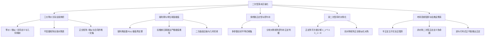

# 第六章 二次型·考研高阶冲刺与深水区强化

## 知识框架拓扑

---

## 1. 线性代数三大等价关系的宏观全景与深度辨析

在高等代数与考研线性代数体系中，同阶方阵之间存在三种最基本、地位崇高的等价关系：**等价 (Equivalence)**、**相似 (Similarity)** 与 **合同 (Congruence)**。

### 1.1 三大关系的定义与几何映射本质

###### **定义[1]: 三大矩阵等价关系对照**

>[1] **等价 (Equivalence, $A \cong B$)**：
>
>> (1) 代数定义：存在 $m$ 阶可逆矩阵 $P$ 和 $n$ 阶可逆矩阵 $Q$，使得 $P A Q = B$。
>
>> (2) 几何本质：同一线性映射在自变量空间与因变量空间分别选取不同基底下的矩阵表示。
>
>[2] **相似 (Similarity, $A \sim B$)**：
>
>> (1) 代数定义：存在 $n$ 阶可逆矩阵 $P$，使得 $P^{-1} A P = B$。
>
>> (2) 几何本质：同一线性变换在定义域空间选取不同基底下的矩阵表示。
>
>[3] **合同 (Congruence, $A \simeq B$)**：
>
>> (1) 代数定义：存在 $n$ 阶可逆矩阵 $C$，使得 $C^{\mathrm{T}} A C = B$。
>
>> (2) 几何本质：同一个二次型（双线性函数）在不同坐标系下的度量矩阵表示。

### 1.2 核心不变量与充要条件对比矩阵表

| 关系名称 | 变换公式 | 充要条件 (实数域) | 保持不变的量 (不变量) | 不一定保持的量 |
| :--- | :--- | :--- | :--- | :--- |
| **等价** ($A \cong B$) | $P A Q = B$ | $r(A) = r(B)$ | 矩阵的秩 $r(A)$ | 行列式、特征值、迹、对称性 |
| **相似** ($A \sim B$) | $P^{-1} A P = B$ | 特征矩阵等价 $\lambda E - A \cong \lambda E - B$ (若可对角化则特征值全相同) | 秩、行列式 $|A|$、迹 $\text{tr}(A)$、特征值、特征多项式 | 对称性、正惯性指数 |
| **合同** ($A \simeq B$) | $C^{\mathrm{T}} A C = B$ | 具有完全相同的正惯性指数 $p$ 与负惯性指数 $q$ ($A, B$ 均为实对称阵) | 秩 $r = p + q$、行列式符号、对称性 | 特征值具体数值、迹 $\text{tr}(A)$ |

### 1.3 桥梁定理：正交矩阵的枢纽作用

###### **定理[1]: 正交变换下相似与合同的统一性**

设 $Q$ 为 $n$ 阶实正交矩阵（即 $Q^{\mathrm{T}} Q = E \iff Q^{\mathrm{T}} = Q^{-1}$），若矩阵 $B = Q^{\mathrm{T}} A Q$，则：

$$B = Q^{\mathrm{T}} A Q = Q^{-1} A Q$$

> 考研结论提炼：
>
> [1] 实正交变换是相似变换与合同变换的 唯一交集。
>
> [2] 若实对称矩阵 $A, B$ 满足正交相似（$Q^{-1}AQ = B$），则它们不仅特征值完全相同（相似），而且正负惯性指数完全相同（合同）。
>
> [3] 反之，若两实对称矩阵相似（$A \sim B$），因实对称矩阵必可正交对角化，它们必具有完全相同的特征值，从而具有相同的正负惯性指数，故 同阶实对称矩阵相似必合同；但同阶实对称矩阵合同 **未必相似**（例如 $\text{diag}(1, 2)$ 与 $\text{diag}(1, 1)$ 合同但不相似）。

---

## 2. 瑞利商 (Rayleigh Quotient) 与单位球面极值定理

在考研综合大题及数学建模、主成分分析中，经常考查目标函数 $f(x) = x^{\mathrm{T}} A x$ 在单位球面 $\|x\|^2 = x^{\mathrm{T}} x = 1$ 上的极大值与极小值。

### 2.1 瑞利商定义与极值定理

###### **定义[2]: 瑞利商**

设 $A$ 为 $n$ 阶实对称矩阵，对任意非零向量 $x \in \mathbb{R}^n$（$x \ne 0$），定义标量函数：

$$R(x) = \frac{x^{\mathrm{T}} A x}{x^{\mathrm{T}} x}$$

为矩阵 $A$ 关于向量 $x$ 的 **瑞利商**。

###### **定理[2]: 瑞利商极值与特征值包络定理**

设 $n$ 阶实对称矩阵 $A$ 的特征值按升序排列为：

$$\lambda_1 \le \lambda_2 \le \dots \le \lambda_n$$

则对任意非零向量 $x \ne 0$，恒有：

$$\lambda_1 \le \frac{x^{\mathrm{T}} A x}{x^{\mathrm{T}} x} \le \lambda_n$$

特别地，在单位球面 $S^{n-1} = \{ x \in \mathbb{R}^n \mid x^{\mathrm{T}} x = 1 \}$ 上：

$$\max_{x^{\mathrm{T}} x = 1} x^{\mathrm{T}} A x = \lambda_n = \lambda_{\max}, \quad \min_{x^{\mathrm{T}} x = 1} x^{\mathrm{T}} A x = \lambda_1 = \lambda_{\min}$$

等号分别在 $x$ 为对应特征值 $\lambda_n$ 与 $\lambda_1$ 的单位特征向量时取得。

### 2.2 极值定理的双重证明

###### **证明方法[1]: 正交对角化变量替换法**

>[1] 因 $A$ 是实对称矩阵，必存在正交矩阵 $Q$ 使得：
>
>$$Q^{\mathrm{T}} A Q = \Lambda = \text{diag}(\lambda_1, \lambda_2, \dots, \lambda_n)$$
>
>[2] 作正交坐标代换 $x = Q y$。由于正交变换保内积与保范数：
>
>$$x^{\mathrm{T}} x = (Q y)^{\mathrm{T}} (Q y) = y^{\mathrm{T}} Q^{\mathrm{T}} Q y = y^{\mathrm{T}} y = \sum_{i=1}^n y_i^2$$
>
>$$x^{\mathrm{T}} A x = (Q y)^{\mathrm{T}} A (Q y) = y^{\mathrm{T}} (Q^{\mathrm{T}} A Q) y = y^{\mathrm{T}} \Lambda y = \sum_{i=1}^n \lambda_i y_i^2$$
>
>[3] 代入瑞利商表达式进行不等式放缩：
>
>$$R(x) = \frac{\sum_{i=1}^n \lambda_i y_i^2}{\sum_{i=1}^n y_i^2}$$
>
>由于 $\lambda_1 \le \lambda_i \le \lambda_n$，故：
>
>$$\lambda_1 \sum_{i=1}^n y_i^2 \le \sum_{i=1}^n \lambda_i y_i^2 \le \lambda_n \sum_{i=1}^n y_i^2$$
>
>两端同时除以正数 $\sum_{i=1}^n y_i^2 > 0$，即证得：
>
>$$\lambda_1 \le R(x) \le \lambda_n$$

###### **证明方法[2]: 条件极值拉格朗日乘数法**

>[1] 构建拉格朗日函数：
>
>目标为求 $f(x) = x^{\mathrm{T}} A x$ 在约束条件 $g(x) = x^{\mathrm{T}} x - 1 = 0$ 下的极值。引入拉格朗日乘子 $\lambda$：
>
>$$L(x, \lambda) = x^{\mathrm{T}} A x - \lambda (x^{\mathrm{T}} x - 1)$$
>
>[2] 对向量 $x$ 求梯度并令其为零：
>
>$$\nabla_x L = 2 A x - 2 \lambda x = 0 \implies A x = \lambda x$$
>
>这说明目标函数取驻点的充分必要条件是：$\lambda$ 恰好为矩阵 $A$ 的特征值，而驻点向量 $x$ 恰为对应特征值 $\lambda$ 的单位特征向量！
>
>[3] 代入驻点求目标函数值：
>
>$$f(x) = x^{\mathrm{T}} A x = x^{\mathrm{T}} (\lambda x) = \lambda (x^{\mathrm{T}} x) = \lambda$$
>
>因此，条件极值的候选点函数值严格等于矩阵 $A$ 的全部特征值，故极大值必为最大特征值 $\lambda_{\max}$，极小值必为最小特征值 $\lambda_{\min}$。

---

## 3. 多参数正定性分析与分块矩阵舒尔补 (Schur Complement)

在考研压轴题中，经常出现矩阵中含有多个未知参数（如 $a, b, c$ 或实矩阵 $B$）的正定性判别。

### 3.1 分块对称矩阵与舒尔补正定判据

###### **定理[3]: 舒尔补 (Schur Complement) 正定判定定理**

设分块实对称矩阵 $M = \begin{bmatrix} A & B \\ \\ B^{\mathrm{T}} & C \end{bmatrix}$，其中 $A$ 为 $p$ 阶实对称正定方阵，$C$ 为 $q$ 阶实对称方阵，$B$ 为 $p \times q$ 实矩阵。

定义矩阵 $S = C - B^{\mathrm{T}} A^{-1} B$ 为子块 $A$ 在矩阵 $M$ 中的 **舒尔补**。则：

$$M \text{ 是正定矩阵} \iff A \text{ 正定且 } C - B^{\mathrm{T}} A^{-1} B \text{ 正定}$$

###### **推导与证明 (高斯合同消元法)**：

>[1] 寻找非退化分块可逆初等变换矩阵消去非主对角块：
>
>构造分块下三角矩阵 $P = \begin{bmatrix} E_p & O \\ \\ -B^{\mathrm{T}} A^{-1} & E_q \end{bmatrix}$，显然 $|P| = |E_p||E_q| = 1 \ne 0$，矩阵 $P$ 可逆。
>
>[2] 计算分块合同变换 $P M P^{\mathrm{T}}$：
>
>$$P M P^{\mathrm{T}} = \begin{bmatrix} E_p & O \\ \\ -B^{\mathrm{T}} A^{-1} & E_q \end{bmatrix} \begin{bmatrix} A & B \\ \\ B^{\mathrm{T}} & C \end{bmatrix} \begin{bmatrix} E_p & -A^{-1} B \\ \\ O & E_q \end{bmatrix}$$
>
>$$= \begin{bmatrix} A & B \\ \\ O & C - B^{\mathrm{T}} A^{-1} B \end{bmatrix} \begin{bmatrix} E_p & -A^{-1} B \\ \\ O & E_q \end{bmatrix} = \begin{bmatrix} A & O \\ \\ O & C - B^{\mathrm{T}} A^{-1} B \end{bmatrix}$$
>
>[3] 根据合同保正定性下结论：
>
>分块准对角矩阵正定当且仅当主对角线上各个独立子块均正定。
>
>故 $M > 0 \iff A > 0$ 且 $C - B^{\mathrm{T}} A^{-1} B > 0$。

---

## 4. 双二次型同时对角化定理 (Simultaneous Diagonalization)

在考研竞赛与高阶线性代数中，如何通过同一个坐标变换将两个二次型同时化为标准型，是极为优美的理论模型。

###### **定理[4]: 双二次型同时正交/合同对角化定理**

设 $A, B$ 均为 $n$ 阶实对称矩阵，且其中矩阵 $A$ **严格正定**（$A > 0$），则必存在可逆实矩阵 $C$，使得：

$$C^{\mathrm{T}} A C = E, \quad C^{\mathrm{T}} B C = \Lambda = \text{diag}(\lambda_1, \lambda_2, \dots, \lambda_n)$$

即同一个线性坐标变换 $x = C y$ 能将二次型 $x^{\mathrm{T}} A x$ 化为单位标准型，同时将二次型 $x^{\mathrm{T}} B x$ 化为标准型。

###### **构造性算法与推导步骤**：

>[1] 第一步：利用正定阵性质作平方根分解化 $A$ 为单位阵：
>
>因为 $A > 0$，必存在可逆实矩阵 $P_1$，使得 $P_1^{\mathrm{T}} A P_1 = E$（配方法或 $P_1 = Q \Lambda^{-1/2}$）。
>
>[2] 第二步：观察该变换对矩阵 $B$ 的作用：
>
>计算 $B_1 = P_1^{\mathrm{T}} B P_1$。
>
>由于 $B_1^{\mathrm{T}} = (P_1^{\mathrm{T}} B P_1)^{\mathrm{T}} = P_1^{\mathrm{T}} B^{\mathrm{T}} P_1 = P_1^{\mathrm{T}} B P_1 = B_1$，故 $B_1$ 仍为实对称矩阵！
>
>[3] 第三步：正交对角化实对称矩阵 $B_1$：
>
>因 $B_1$ 为实对称矩阵，必存在正交矩阵 $Q_1$（满足 $Q_1^{\mathrm{T}} Q_1 = E$），使得：
>
>$$Q_1^{\mathrm{T}} B_1 Q_1 = \Lambda = \text{diag}(\lambda_1, \dots, \lambda_n)$$
>
>[4] 第四步：构造复合变换矩阵 $C$：
>
>令 $C = P_1 Q_1$。因 $P_1, Q_1$ 均可逆，故 $C$ 必为可逆矩阵。验证其对 $A$ 和 $B$ 的作用：
>
>$$C^{\mathrm{T}} A C = (P_1 Q_1)^{\mathrm{T}} A (P_1 Q_1) = Q_1^{\mathrm{T}} (P_1^{\mathrm{T}} A P_1) Q_1 = Q_1^{\mathrm{T}} E Q_1 = Q_1^{\mathrm{T}} Q_1 = E$$
>
>$$C^{\mathrm{T}} B C = (P_1 Q_1)^{\mathrm{T}} B (P_1 Q_1) = Q_1^{\mathrm{T}} (P_1^{\mathrm{T}} B P_1) Q_1 = Q_1^{\mathrm{T}} B_1 Q_1 = \Lambda$$
>
>结论获证。对角元 $\lambda_i$ 恰好为广义特征值方程 $B x = \lambda A x$ 的根。

---

## 5. 考研高频思维陷阱与反例辨析库 (避坑指南)

###### **辨析[1]: 矩阵半正定的主子式判定陷阱**

>致命误区：“正定矩阵充要条件是各阶顺序主子式全大于零，所以半正定矩阵充要条件是各阶顺序主子式全大于等于零”。
>
>> (1) 错误辨析：顺序主子式仅代表从左上角出发的前 $k$ 阶主子式。如果后面的主对角元出现负数，前 $k$ 阶顺序主子式依然可能为 0 而非负。
>
>> (2) 经典反例：设矩阵 $A = \begin{bmatrix} 0 & 0 \\ \\ 0 & -1 \end{bmatrix}$。
>>
>> 其一阶顺序主子式为 $\Delta_1 = 0 \ge 0$；二阶顺序主子式为 $\Delta_2 = |A| = 0 \ge 0$。
>>
>> 顺序主子式全部大于等于零！然而，取向量 $x = [0, 1]^{\mathrm{T}}$，二次型 $x^{\mathrm{T}} A x = -1 < 0$。该矩阵显然是 **半负定** 的，根本不是半正定矩阵！
>
>> (3) 考研权威定论：实对称矩阵半正定的充要条件是 所有的主子式（共 $2^n - 1$ 个）全部大于等于零，而不能仅仅要求顺序主子式！

###### **辨析[2]: 非对称矩阵讨论二次型正定性的逻辑陷阱**

>致命误区：“若对于任意非零向量 $x \ne 0$ 恒有 $x^{\mathrm{T}} A x > 0$，则矩阵 $A$ 必为正定矩阵”。
>
>> (1) 错误辨析：考研数学中“正定矩阵”的概念是 **严格建立在实对称矩阵前提下** 的。若矩阵 $A$ 非对称，即便满足该不等式，其本身也不具备正定矩阵的代数性质（如特征值可能为复数、不可正交对角化）。
>
>> (2) 经典反例：设 $A = \begin{bmatrix} 1 & 2 \\ \\ -2 & 1 \end{bmatrix}$。
>>
>> 计算二次型：$x^{\mathrm{T}} A x = [x_1, x_2] \begin{bmatrix} x_1 + 2x_2 \\ \\ -2x_1 + x_2 \end{bmatrix} = x_1(x_1+2x_2) + x_2(-2x_1+x_2) = x_1^2 + x_2^2$。
>>
>> 对任意 $[x_1, x_2]^{\mathrm{T}} \ne 0$，恒有 $x_1^2 + x_2^2 > 0$。
>>
>> 但是矩阵 $A$ 的特征值为 $\lambda = 1 \pm 2i$，根本不是实数！且 $A$ 非对称，因此不能称 $A$ 为正定矩阵。
>
>> (3) 考研解题准绳：遇到形如 $x^{\mathrm{T}} B x$ 的二次型，必须首先通过 $A = \frac{1}{2}(B + B^{\mathrm{T}})$ 对称化，对实对称矩阵 $A$ 讨论特征值与正定性。

###### **辨析[3]: 迹与行列式全大于零能推出正定吗？**

>致命误区：“实对称矩阵满足 $\text{tr}(A) > 0$ 且 $|A| > 0$，则矩阵 $A$ 必为正定矩阵”。
>
>> (1) 错误辨析：特征值之和为正且特征值之积为正，不能保证每个特征值全为正数！四阶或三阶矩阵均存在反例。
>
>> (2) 经典反例：设 3 阶实对称矩阵 $A = \text{diag}(5, -1, -2)$。
>>
>> 计算迹与行列式：
>>
>> $$\text{tr}(A) = 5 + (-1) + (-2) = 2 > 0$$
>>
>> $$|A| = 5 \times (-1) \times (-2) = 10 > 0$$
>>
>> 迹与行列式均为正数！但其特征值包含两个负数，其正惯性指数 $p=1$，负惯性指数 $q=2$，是不定矩阵，绝非正定矩阵！
>
>> (3) 结论：$\text{tr}(A) > 0$ 且 $|A| > 0$ 仅仅是正定的必要条件，在选择题中切忌当作充分条件。
