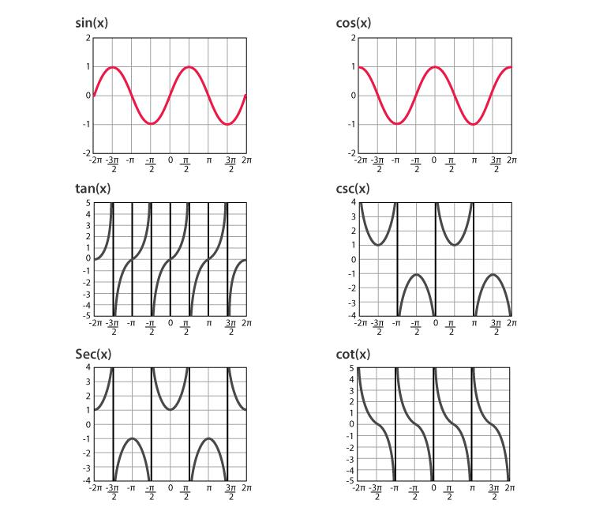

# Chap4一元函数微分学的计算

目的[1]:掌握四则运算和复合函数求导/初等函数的求数公式

目的[2]:掌握微分四则运算/一阶微分形式的不变性

目的[3]:求分段函数的导数/隐函数+参数方程确定的函数/反函数的导数

## 1.基本初等函数求导公式与四则运算

###### **原理[1]:基本求导函数**

$(x^\alpha)' = \alpha x^{\alpha-1}$	$(a^x)' = a^x \ln a$	$(e^x)' = e^x$

$(\log_a x)' = \frac{1}{x \ln a}$	$(\ln\vert{}x\vert{})' = \frac{1}{x} \ (x \neq 0)$

***

###### **原理[2]:三角函数/反三角函数求导函数**

($secx=\frac{1}{cosx}$,$cscx = \frac{1}{sinx}$,$cotx=\frac{1}{tanx}$)

$(\sin x)' = \cos x$	$(\cos x)' = -\sin x$	$(\tan x)' = \sec^2 x$

$(\cot x)' = -\csc^2 x$    [$(\frac{1}{tanx})'=-\frac{1}{sin^2x}$]     

$(\sec x)' = \sec x \tan x$  [$(\frac{1}{cosx})'=\frac{tanx}{cosx}$] 

$(\csc x)' = -\csc x \cot x$ [$(\frac{1}{sinx})'=-\frac{1}{sinxtanx}$]

$(\arcsin x)' = \frac{1}{\sqrt{1-x^2}}$ $(\arccos x)' = -\frac{1}{\sqrt{1-x^2}}$   

$(\arctan x)' = \frac{1}{1+x^2}$  $(\operatorname{arccot} x)' = -\frac{1}{1+x^2}$	

| **函数 \ 弧度** | **0**  | **$\frac{1}{6}$π**    | **$\frac{1}{4}$π**   | **$\frac{1}{3}$π**    | **$\frac{1}{2}$π** | **$\frac{3}{2}$π**    | **$\frac{3}{4}$π**    | **$\frac{5}{6}$π**     | **π**  | **$\frac{3}{2}$π** | **2π** |
| --------------- | ------ | --------------------- | -------------------- | --------------------- | ------------------ | --------------------- | --------------------- | ---------------------- | ------ | ------------------ | ------ |
| **$\sin x$**    | $0$    | $\frac{1}{2}$         | $\frac{\sqrt{2}}{2}$ | $\frac{\sqrt{3}}{2}$  | $1$                | $\frac{\sqrt{3}}{2}$  | $\frac{\sqrt{2}}{2}$  | $\frac{1}{2}$          | $0$    | $-1$               | $0$    |
| **$\cos x$**    | $1$    | $\frac{\sqrt{3}}{2}$  | $\frac{\sqrt{2}}{2}$ | $\frac{1}{2}$         | $0$                | $-\frac{1}{2}$        | $-\frac{\sqrt{2}}{2}$ | $-\frac{\sqrt{3}}{2}$  | $-1$   | $0$                | $1$    |
| **$\tan x$**    | $0$    | $\frac{\sqrt{3}}{3}$  | $1$                  | $\sqrt{3}$            | 不存在             | $-\sqrt{3}$           | $-1$                  | $-\frac{\sqrt{3}}{3}$  | $0$    | 不存在             | $0$    |
|                 |        |                       |                      |                       |                    |                       |                       |                        |        |                    |        |
| **$\cot x$**    | 不存在 | $\sqrt{3}$            | $1$                  | $\frac{\sqrt{3}}{3}$  | $0$                | $-\frac{\sqrt{3}}{3}$ | $-1$                  | $-\sqrt{3}$            | 不存在 | $0$                | 不存在 |
| **$\sec x$**    | $1$    | $\frac{2\sqrt{3}}{3}$ | $\sqrt{2}$           | $2$                   | 不存在             | $-2$                  | $-\sqrt{2}$           | $-\frac{2\sqrt{3}}{3}$ | $-1$   | 不存在             | $1$    |
| **$\csc x$**    | 不存在 | $2$                   | $\sqrt{2}$           | $\frac{2\sqrt{3}}{3}$ | $1$                | $\frac{2\sqrt{3}}{3}$ | $\sqrt{2}$            | $2$                    | 不存在 | $-1$               | 不存在 |


<p align="center">
  <style>text{font-family:sans-serif;font-size:12px;fill:%23555}.axis{stroke:%23666;stroke-width:1.5}.grid{stroke:%23eee;stroke-width:1;stroke-dasharray:3,3}.curve{fill:none;stroke-width:2.5}</style><rect x='-220' y='-180' width='440' height='360' fill='%23fff'/><path d='M-200,0 H200 M0,-160 V160' class='axis'/><path d='M-180,-140 H180 M-180,-70 H180 M-180,70 H180 M-180,140 H180 M-90,-150 V150 M90,-150 V150' class='grid'/><text x='185' y='-8'>x</text><text x='10' y='-145'>y</text><text x='85' y='16'>1</text><text x='-105' y='16'>-1</text><text x='8' y='-135'>π</text><text x='8' y='-65'>π/2</text><text x='8' y='75'>-π/2</text><text x='-15' y='16'>0</text><path d='M-90,70 C-90,50 -40,30 0,0 C40,-30 90,-50 90,-70' class='curve' stroke='%23d9534f'/><circle cx='-90' cy='70' r='3.5' fill='%23d9534f'/><circle cx='90' cy='-70' r='3.5' fill='%23d9534f'/><path d='M-90,-140 C-90,-120 -40,-100 0,-70 C40,-40 90,-20 90,0' class='curve' stroke='%23337ab7'/><circle cx='-90' cy='-140' r='3.5' fill='%23337ab7'/><circle cx='90' cy='0' r='3.5' fill='%23337ab7'/><line x1='-190' y1='-70' x2='190' y2='-70' stroke='%235cb85c' stroke-dasharray='4,4'/><line x1='-190' y1='70' x2='190' y2='70' stroke='%235cb85c' stroke-dasharray='4,4'/><path d='M-180,62 C-100,58 -45,35 0,0 C45,-35 100,-58 180,-62' class='curve' stroke='%235cb85c'/><g transform='translate(-200,-150)'><circle cx='10' cy='5' r='5' fill='%23d9534f'/><text x='25' y='9' font-weight='bold'>arcsin(x)</text><circle cx='105' cy='5' r='5' fill='%23337ab7'/><text x='120' y='9' font-weight='bold'>arccos(x)</text><circle cx='200' cy='5' r='5' fill='%235cb85c'/><text x='215' y='9' font-weight='bold'>arctan(x)</text></g></svg>" alt="Inverse Trigonometric Functions" />
</p>

a

****

###### **原理[3]:双曲反函数求导函数**

$[\ln(x + \sqrt{x^2+a^2})]' = \frac{1}{\sqrt{x^2+a^2}}$（特别地，$a=1$时为$\frac{1}{\sqrt{x^2+1}}$）

$[\ln(x + \sqrt{x^2-1})]' = \frac{1}{\sqrt{x^2-1}}$

****

###### **原理[4]:导数的四则运算**

设$u=u(x), v=v(x)$均可导：

和:$[u(x) + v(x)]' = u'(x) + v'(x)$

差:$[u(x) - v(x)]' = u'(x) - v'(x)$

积:$[u(x)v(x)]' = u'(x)v(x) + u(x)v'(x)$

 $[uvw]' = u'vw + uv'w + uvw'$

商:$\left[\frac{u(x)}{v(x)}\right]' = \frac{u'(x)v(x) - u(x)v'(x)}{[v(x)]^2} \ (v(x) \neq 0)$

***

###### **原理[5]:复合函数求导**

原理:设$y=f(u)$在点$u$可导,$u=g(x)$在点$x$可导，

则复合函数$y=f[g(x)]$在点$x$可导,且:

$$\{f[g(x)]\}' = f'[g(x)] \cdot g'(x) \quad \left(\text{即 } \frac{\mathrm{d}y}{\mathrm{d}x} = \frac{\mathrm{d}y}{\mathrm{d}u} \cdot \frac{\mathrm{d}u}{\mathrm{d}x}\right)$$

***

###### **原理[6]:分段函数求导**

设$f(x) = \begin{cases} f_1(x), & x \ge x_0 \\ \\ f_2(x), & x < x_0 \end{cases}$

对非分段点($x \neq x_0$):直接求导

对于分段点($x = x_0$):[1]用导数定义求左、右导数[2]如果在$x_0$连续,则$f'_+(x_0) = \lim_{x \to x_0^+} f'(x)$

>   $$f'_+(x_0) = \lim_{x \to x_0^+} \frac{f_1(x) - f(x_0)}{x - x_0}, \quad f'_-(x_0) = \lim_{x \to x_0^-} \frac{f_2(x) - f(x_0)}{x - x_0}$$
>
>   若$f'_+(x_0) = f'_-(x_0)$,则导数存在,且$f'(x_0)$等于该极限；否则不可导

***

###### **原理[7]:反函数求导**

设$y=f(x)$单调、可导且$f'(x) \neq 0$,其反函数为$x=\varphi(y)$：

一阶导数：$\frac{\mathrm{d}x}{\mathrm{d}y} = \frac{1}{\frac{\mathrm{d}y}{\mathrm{d}x}}$，即$\varphi'(y) = \frac{1}{f'(x)}$

二阶导数：$$\varphi''(y) = \frac{\mathrm{d}}{\mathrm{d}y}\left(\frac{1}{f'(x)}\right) = \frac{\mathrm{d}}{\mathrm{d}x}\left(\frac{1}{f'(x)}\right) \cdot \frac{\mathrm{d}x}{\mathrm{d}y} = -\frac{f''(x)}{[f'(x)]^2} \cdot \frac{1}{f'(x)} = -\frac{f''(x)}{[f'(x)]^3}$$

***

###### **原理[8]:隐函数求导**

操作[1]:由方程$F(x, y) = 0$确定的可导函数$y = y(x)$：

操作[2]:方程两边直接对$x$求导

>   注意将$y$视为$x$的函数（如$(y^2)' = 2y \cdot y'$，$(xy)' = y + x y'$）

操作[3]:解出含$y'$的代数方程即可求得$y'$

***

###### **原理[9]:参数函数求导**

设曲线由参数方程$\begin{cases} x = \varphi(t) \\ y = \psi(t) \end{cases}$确定，其中$\varphi(t), \psi(t)$可导且$\varphi'(t) \neq 0$：

**一阶导数**：

```math
\frac{\mathrm{d}y}{\mathrm{d}x} = \frac{\frac{\mathrm{d}y}{\mathrm{d}t}}{\frac{\mathrm{d}x}{\mathrm{d}t}} = \frac{\psi'(t)}{\varphi'(t)}
```

**二阶导数**：

```math
\frac{\mathrm{d}^2y}{\mathrm{d}x^2} = \frac{\mathrm{d}}{\mathrm{d}x}\left(\frac{\mathrm{d}y}{\mathrm{d}x}\right) = \frac{\frac{\mathrm{d}}{\mathrm{d}t}\left(\frac{\mathrm{d}y}{\mathrm{d}x}\right)}{\frac{\mathrm{d}x}{\mathrm{d}t}} = \frac{\psi''(t)\varphi'(t) - \psi'(t)\varphi''(t)}{[\varphi'(t)]^3}
```

***

###### **原理[10]:对数/幂指求导法**

(适用于多项乘除/开方乘方/幂指函数$y = u(x)^{v(x)}$)

**操作[1]:对数求导法**

两边取自然对数$\ln y = v(x)\ln u(x)$，两边对$x$求导得$\frac{y'}{y} = [v(x)\ln u(x)]'$，从而$y' = y \cdot [v(x)\ln u(x)]'$

**操作[2]化为复合指数求导:**

写成$u(x)^{v(x)} = e^{v(x)\ln u(x)}$后直接用复合函数链式法则

## 2.微分运算与一阶微分形式不变性

###### **原理[6]:微分四则运算**

$\mathrm{d}(u + v) = \mathrm{d}u + \mathrm{d}v$

$\mathrm{d}(u - v) = \mathrm{d}u - \mathrm{d}v$

$\mathrm{d}(uv) = v\,\mathrm{d}u + u\,\mathrm{d}v$

$\mathrm{d}\left(\frac{u}{v}\right) = \frac{v\,\mathrm{d}u - u\,\mathrm{d}v}{v^2} \ (v \neq 0)$

###### **原理[7]:一阶微分形式不变性**

无论是$x$作为自变量,还是$u=g(x)$作为中间变量,$y=f(u)$的微分形式始终保持：

$$\mathrm{d}y = f'(u)\,\mathrm{d}u$$

>   一阶微分形式不变性是凑微分法与链式法则的核心基础
>
>   微分运算:不断使用基本公式:$dy = f'(y)du = f'(y)f'(u)dx$,使得化简为dx

###### **原理[8]:凑微分(反向换元)**

比如$\int\frac{2x}{x^2+1}dx$,其中$d(x^2+1)=2xdx$,所以$I=\frac{d(x^2+1)}{x^2+1}=ln(x^2+1)+C$

