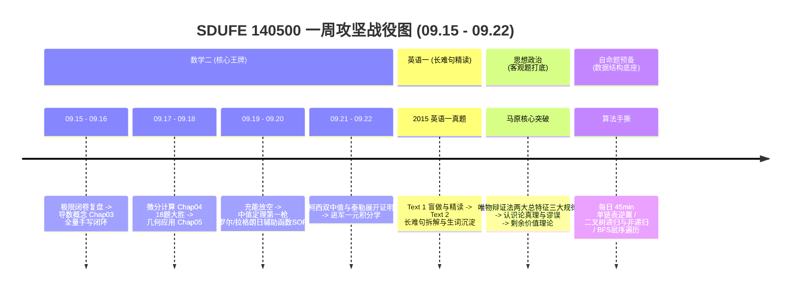

# SDUFE 140500 智能科学与技术 全局周度作战蓝图 (2026-09-15 ~ 2026-09-22)

> **制定时间**: 2026-09-15 (2026-09-17 战略重大升级调整)  
> **核心战略转折**: **正式锁定【山东财经大学 140500 智能科学与技术 (学硕)】！** 卸下 408 统考硬件与协议冗余包袱，全面聚焦【数学二极限攻坚 + 英语一长难句精读 + 政治马原客观题启动 + 数据结构经典算法手撕】。  
> **时间约束**: **周五下午 ~ 周六下午全面放空**（学校上课 + 每周固定放假充电，零学习负罪感）。

---

## 一、科目战役目标与推进路线

### 1. 302 数学二（高数微分攻坚 + 线代滚动）
- **高数线**:
  - 【已完成】**Chap01~02 极限与连续**、**Chap03 导数概念 (15题)**、**Chap04 导数计算 (18题)**；
  - 攻下几何应用：**Chap05 几何应用**（切线、极值、单调性、凹凸性渐近线）；
  - 啃下考研证明大山：**Chap06 中值定理与微分等式/不等式**（罗尔、拉格朗日、柯西、泰勒构造 SOP）；
  - 迈入积分大门：**Chap08 一元积分学的概念与性质**；
  - **精选强化**：每章核心难点挑选《李林880》对应章节 3~5 道题攻坚。
- **线代线**:
  - 每晚轮动：刷完 **Chap01 行列式**，稳步开进 **Chap02 矩阵运算**。

### 2. 201 英语一（真题精读为主）
- 每天固定 1.0h ~ 1.25h：
  - 2015 英语一真题阅读逐篇精读；
  - 重点拆解划线长难句主干，积累真题高频核心生词与熟词生义。

### 3. 101 思想政治（客观题选择题启动）
- 每天 1.0h（下午或晚间）：
  - 结合徐涛/腿姐核心考点，重点理解马原哲学三大规律、认识论、政经剩余价值计算；
  - 配合肖秀荣 1000 题单选多选，扫除易混淆概念。

### 4. 自命题数据结构与算法储备
- 每天 45min：手撕一题核心算法（二叉树遍历、单链表、排序 Partition），为国庆后正式公布自命题大纲筑牢底盘。

---

## 二、一周时间表概览（周五六假期友好型）

| 日期 | 星期 | 可支配时长 | 核心攻坚任务 | 状态与说明 |
| :---: | :---: | :---: | :--- | :--- |
| **09-15** | 二 | 8.5h | 高数极限复盘 + 导数概念前半 | 已完成 |
| **09-16** | 三 | 9.5h | 高数 Chap03 1000a 基础篇全量手写闭环 | 已完成 |
| **09-17** | 四 | 9.0h | 高数 Chap04 微分计算 18 题大胜闭环 + 锁定 140500 新纪元 | 已完成 |
| **09-18** | 五 | 4.0h | 高数 Chap05 几何应用(极值/凹凸/渐近线) + 英语一 2015 Text 1 | 上午学习，下午/晚上上课休息 |
| **09-19** | 六 | 0.0h | 全天上课 + 彻底放空充电回血，零负罪感！ | 放松蓄力 |
| **09-20** | 日 | 9.5h | 中值定理第一枪(罗尔/拉格朗日辅助函数SOP) + 政治马原哲学 + 二叉树手撕 | 正常全天 |
| **09-21** | 一 | 9.0h | 柯西中值与双中值综合 + 英语一 2015 Text 2 + 政治认识论 + 线代行列式 | 正常全天 |
| **09-22** | 二 | 9.0h | 泰勒展开与不等式证明 + 政治政经计算 + 英语一 2015 Text 3 | 正常全天 |
