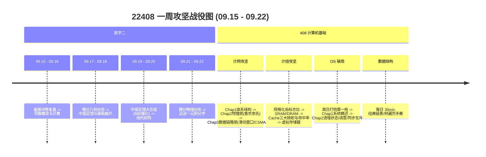

# 22408 全局周度作战蓝图 (2026-09-15 ~ 2026-09-22)

> **制定时间**: 2026-09-15  
> **核心目标**: 高数微分学全线通关 + 计组攻克 Cache 存储器 + OS 破局首战 + 计网搞定数据链路层 + 880/1000 基础强化双轨驱动。  
> **时间约束**: **周五下午 ~ 周六下午全面放空**（学校上课 + 每周固定放假充电，零学习负罪感）。

---

## 一、科目战役目标与推进路线

### 1. 302 数学二（高数微分攻坚 + 线代滚动）
- **高数线**:
  - 彻底跨越基础篇：攻下 **Chap03 导数概念**、**Chap04 导数计算**、**Chap05 几何应用**；
  - 啃下考研第一座大山：**Chap06 中值定理与微分等式/不等式**（罗尔、拉格朗日、柯西、泰勒构造 SOP）；
  - 试水积分大门：**Chap08 一元积分学的概念与性质**；
  - **880 与 1000 双轨机制**：1000 题先打通骨架，每章核心难点挑选《李林880》对应章节 3~5 道强化题攻坚，绝不在基础未全前盲目全铺。
- **线代线**:
  - 每晚 1h 轮动：刷完 **Chap01 行列式**（1000a + 880 精选题），稳步开进 **Chap02 矩阵运算**。

### 2. 408 计算机基础（三科并进 + 一科保温）
- **计算机组成原理**:
  - 现状：规格化刚刚学完；
  - 本周进攻方向：定点运算标志位（OF, SF, ZF, CF）$\to$ **存储系统核心（SRAM/DRAM/ROM）** $\to$ **408 必考大题：Cache 直接/全相联/组相联映射及命中率计算** $\to$ **虚存 TLB/Page/Cache 三级联动**。
- **操作系统 (OS)**:
  - 现状：尚未开启；
  - 本周战略破局：**周日正式打响第一枪**！连贯拿下 **Chap1 系统概述（内核态/用户态、中断异常、系统调用）** 与 **Chap2 进程管理核心（进程状态转换、经典调度算法）**。
- **计算机网络**:
  - 现状：Chap1 刚刚开启；
  - 本周攻坚路线：拿下 Chap1 性能指标计算 $\to$ Chap2 物理层（香农/奈氏准则、编码调制） $\to$ **Chap3 数据链路层核心（滑动窗口协议利用率计算、CSMA/CD 协议、交换机自学习）**。
- **数据结构**:
  - 现状：复习相对完整；
  - 维护策略：**每日 30~45 分钟保温**，每天手撕 1 题（链表逆置/快慢指针、二叉树递归非递归、二叉搜索树、图遍历）+ 5~10 道真题选择。

### 3. 204 英语二
- 每天傍晚固定 1.0h ~ 1.25h：历年真题阅读精读 1 篇（长难句拆解剖析）+ 50 个考点核心词汇温习。

---

## 二、一周时间表概览（周五六假期友好型）

| 日期 | 星期 | 可支配时长 | 核心攻坚任务 | 放假/课表说明 |
| :---: | :---: | :---: | :--- | :--- |
| **09-15** | 二 | 8.5h | 高数数列极限复盘 + Chap03导数概念前半 + 计网Chap1体系结构笔记（晚间开会，后半与Chap04计算顺延至16日） | 突发会议 |
| **09-16** | 三 | 9.5h | 【动态补漏+主线并进】高数Chap03 1000a收尾+Chap04微分计算全扫+Chap05几何应用 + 计网Chap1题目闭环+物理层全清 + 计组主存SRAM/DRAM + 英语阅读 | 动态吸收 |
| **09-17** | 四 | 9.0h | 高数Chap06中值定理(上:构造辅助函数SOP) + 计组Cache三大映射与命中率(必考大题) + 数据结构二叉树手撕 + 880微分 | 正常全天 |
| **09-18** | 五 | **4.0h (半天)** | **【上午】** 高数Chap06泰勒与不等式 + 计网Chap3数据链路层开篇（CRC校验） **【下午 & 晚间】学校上课 + 每周固定放假，彻底放空休息！** | **半天休假** |
| **09-19** | 六 | **5.5h (下午回归)** | **【上午】学校上课/睡眠补充/自由活动** **【下午 & 晚间】** 计组虚拟存储器(TLB/Page/Cache三级联动) + 线代行列式收尾/矩阵开启 + 英语阅读 | **半天休假** |
| **09-20** | 日 | 9.5h | 高数Chap06中值定理大合拢(880强化攻坚) + **【OS第一枪】Chap1系统概述** + 计网Chap3滑动窗口利用率计算 + 树/图手撕 | 正常全天 |
| **09-21** | 一 | 9.0h | 高数Chap07物理/经济应用与微分总脑图 + **OS Chap2进程状态与经典调度算法** + 线代初等变换与逆矩阵 + 英语精读 | 正常全天 |
| **09-22** | 二 | 9.0h | 高数进入Chap08一元积分学概念与反常积分 + **OS 经典同步互斥信号量建模** + 计网CSMA/CD与以太网交换机 + 全周大对账 | 正常全天 |

---

## 三、作战纪律与 NOTICE.md 检视指南

1. **绝对不搞虚假繁荣**：
   - 880 只做符合当前知识体系的精选题，绝不拿未学的工具强行去硬解难题。
   - 遇到中值定理证明题，必须遮住解析、自己构造出辅助函数并在草稿纸上把闭区间连续、开区间可导的端点值算齐。
2. **放假期间零负罪感**：
   - 周五下午到周六下午是雷打不动的“回血蓄能区”，尽情休息、上课、散步、睡饱，为周日周一的高强度攻坚蓄满多巴胺。
